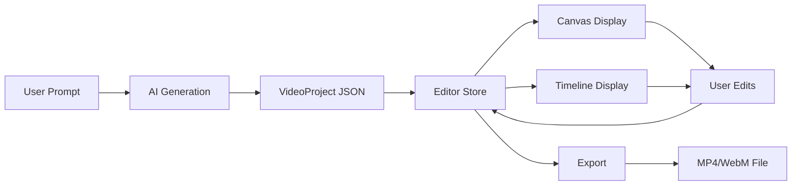

# Videographic - Project Overview

## 🎬 What is Videographic?

Videographic is a **web-based AI-powered video editor** that allows users to:

1. **Describe a video in natural language** → The AI generates a complete video timeline
2. **Edit the video visually** → Using a canvas-based editor with timeline controls
3. **Export to MP4/WebM** → Render the final video using modern browser APIs

Think of it as "Canva meets AI for video creation" - you describe what you want, and the system creates it.

---

## 🏗️ How It Works (High-Level)



### The Three Main Flows

| Flow | Description |
|------|-------------|
| **AI Generation** | User writes a prompt → AI returns valid JSON → Stored as VideoProject |
| **Editing** | User interacts with Canvas/Timeline → Changes update the store → UI re-renders |
| **Export** | Store data → Rendered frame-by-frame → Encoded as video file |

---

## 📖 Glossary of Key Terms

Before diving deeper, familiarize yourself with these core concepts:

| Term | Definition |
|------|------------|
| **VideoProject** | The main data structure containing all video settings and elements |
| **TimelineEvent** | A single element in the video (text, shape, image, audio, etc.) |
| **Canvas** | The visual editing area powered by Fabric.js where elements are rendered |
| **Timeline** | The horizontal track view showing when elements appear/disappear |
| **Animation** | Property changes over time (opacity, position, scale, rotation) |
| **Transition** | Visual effects when elements enter/exit (fade, slide, scale) |
| **Layer** | Z-index ordering - higher layers appear in front |
| **GSAP** | GreenSock Animation Platform - the animation engine used |
| **Fabric.js** | HTML5 canvas library for object-based drawing and interactions |
| **Zustand** | Lightweight state management library for React |
| **WebCodecs** | Browser API for encoding video frames (Chrome) |
| **MediaRecorder** | Browser API for recording canvas (Firefox fallback) |

---

## 🗂️ Project Structure Overview

```
src/
├── app/                    # Next.js pages & API routes
│   ├── (auth)/            # Login page (public)
│   ├── (dashboard)/       # Protected routes
│   │   ├── dashboard/     # Project gallery
│   │   └── editor/[id]/   # Video editor
│   └── api/               # REST API endpoints
│
├── components/            # React components
│   ├── auth/              # Login UI
│   ├── dashboard/         # Project cards, grid
│   ├── editor/            # Canvas, Timeline, PropertyPanel
│   └── landing/           # Homepage sections
│
├── lib/                   # Core logic
│   ├── ai/                # AI generation (prompts, API clients)
│   ├── canvas/            # Grid system, collision detection
│   ├── core/              # Video rendering & export
│   ├── data/              # Database operations
│   └── schemas/           # Zod validation schemas
│
├── stores/                # Zustand state stores
├── hooks/                 # Custom React hooks
├── types/                 # TypeScript type definitions
└── workers/               # Web Workers for background tasks
```

---

## 🛤️ Recommended Learning Path

Read the documentation in this order to rebuild the app step-by-step:

| # | File | What You'll Learn |
|---|------|-------------------|
| 0 | **[00-overview.md](./00-overview.md)** | You are here! Big picture understanding |
| 1 | **[01-project-setup.md](./01-project-setup.md)** | Next.js setup, dependencies, folder structure |
| 2 | **[02-data-schemas.md](./02-data-schemas.md)** | Core data structures (VideoProject, TimelineEvent) |
| 3 | **[03-database.md](./03-database.md)** | PostgreSQL + Prisma ORM setup |
| 4 | **[04-auth.md](./04-auth.md)** | Google OAuth with NextAuth.js |
| 5 | **[05-state-management.md](./05-state-management.md)** | Zustand store for editor state |
| 6 | **[06-fabric-canvas.md](./06-fabric-canvas.md)** | Canvas rendering with Fabric.js |
| 7 | **[07-animation-engine.md](./07-animation-engine.md)** | Animation interpolation and easing |
| 8 | **[08-timeline-component.md](./08-timeline-component.md)** | Timeline UI component |
| 9 | **[09-editor-architecture.md](./09-editor-architecture.md)** | Full editor structure and layout |
| 10 | **[10-render-export.md](./10-render-export.md)** | Video export pipeline |
| 11 | **[11-ai-generation.md](./11-ai-generation.md)** | AI prompt-to-video system |
| 12 | **[12-api-routes.md](./12-api-routes.md)** | REST API reference |

---

## 🔧 Tech Stack Quick Reference

| Layer | Technology | Purpose |
|-------|------------|---------|
| **Frontend** | Next.js 16 (App Router) | Server-side rendering, routing |
| **UI** | React 19 + TypeScript | Component-based UI |
| **Styling** | Tailwind CSS v4 | Utility-first CSS |
| **Animations** | Framer Motion | Page transitions, UI animations |
| **State** | Zustand | Global state management |
| **Canvas** | Fabric.js 7 | 2D canvas with object model |
| **Video Animations** | GSAP 3 | Timeline-based animations |
| **Video Export** | mp4-muxer, webm-muxer | Video file encoding |
| **Validation** | Zod | Schema validation |
| **Auth** | NextAuth.js v5 | Authentication |
| **Database** | PostgreSQL (Neon) | Serverless database |
| **ORM** | Prisma 7 | Database queries |

---

## 🚀 Quick Start Commands

```bash
# Install dependencies
npm install

# Set up database (requires DATABASE_URL in .env)
npx prisma db push

# Start development server
npm run dev

# Open browser
# http://localhost:3000
```

---

## 📁 Key Files to Explore

Start with these files to understand the core:

| File | Why It's Important |
|------|-------------------|
| `src/stores/editor-store.ts` | The heart of state management |
| `src/lib/schemas/timeline.ts` | All data structure definitions |
| `src/lib/core/FabricRenderer.ts` | Renders data to canvas |
| `src/lib/ai/prompts.ts` | AI system prompt and validation |
| `src/components/editor/EditorClient.tsx` | Main editor component |

---

## ❓ Common Questions

### "Where does the video data live?"
→ In the Zustand store (`editor-store.ts`) during editing, and in PostgreSQL (via Prisma) for persistence.

### "How does AI know what to generate?"
→ A carefully crafted system prompt in `prompts.ts` tells the AI exactly what JSON structure to output.

### "How are animations rendered?"
→ GSAP interpolates property values, and `FabricRenderer` applies them to Fabric.js objects each frame.

### "What browsers are supported?"
→ Chrome (WebCodecs for export) and Firefox (MediaRecorder fallback). Safari has limited support.

---

## 📚 Next Steps

Ready to dive in? Start with **[01-project-setup.md](./01-project-setup.md)** to set up your development environment.

---

*This documentation was created to help you understand and rebuild the Videographic project step-by-step.*
