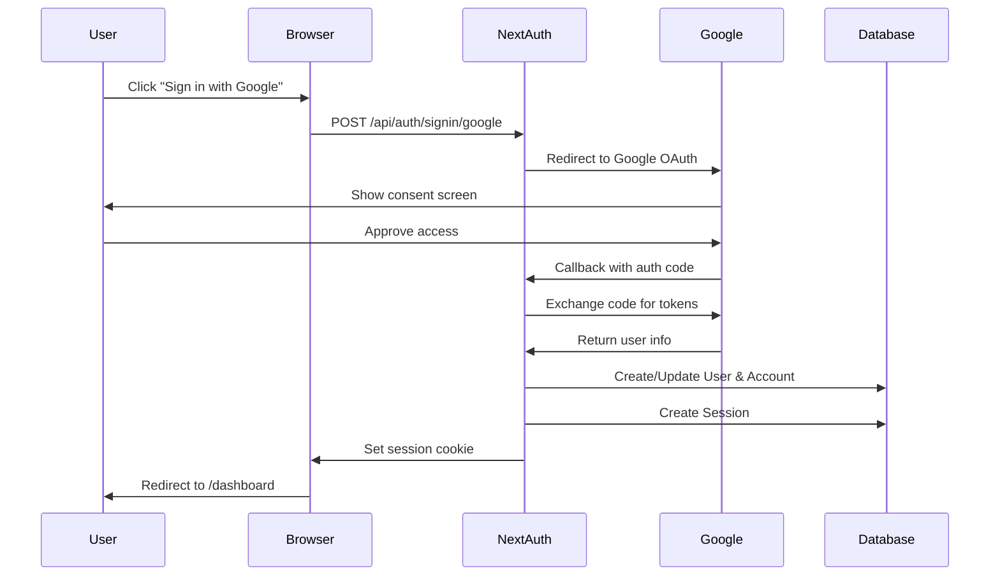

# Authentication System

> **Prerequisites**: Read [00-overview.md](./00-overview.md) first.
>
> **Key Files**:
> - [`src/lib/auth.ts`](file:///c:/Users/kiran/code/p/videographic/videographic%20nextjs/src/lib/auth.ts) - NextAuth configuration
> - [`src/middleware.ts`](file:///c:/Users/kiran/code/p/videographic/videographic%20nextjs/src/middleware.ts) - Route protection
> - [`prisma/schema.prisma`](file:///c:/Users/kiran/code/p/videographic/videographic%20nextjs/prisma/schema.prisma) - Database models

---

## 🎯 What You'll Learn

- How NextAuth.js v5 (Auth.js) is configured
- The Google OAuth flow from login to dashboard
- How routes are protected with middleware
- Database models for users and sessions
- How to access user data in components

---

## 🔐 Authentication Overview

Videographic uses **NextAuth.js v5** (also called Auth.js) with:

- **Provider**: Google OAuth 2.0
- **Session Strategy**: Database sessions (not JWT)
- **Database**: PostgreSQL via Prisma adapter



---

## ⚙️ NextAuth Configuration

The main auth configuration lives in `src/lib/auth.ts`:

```typescript
// src/lib/auth.ts

import NextAuth from "next-auth";
import Google from "next-auth/providers/google";
import { PrismaAdapter } from "@auth/prisma-adapter";
import { db } from "@/lib/db";

export const {
  handlers,    // Route handlers for /api/auth/*
  auth,        // Get session (server-side)
  signIn,      // Trigger sign in
  signOut,     // Trigger sign out
} = NextAuth({
  adapter: PrismaAdapter(db),           // Stores data in PostgreSQL
  providers: [
    Google({
      clientId: process.env.GOOGLE_CLIENT_ID!,
      clientSecret: process.env.GOOGLE_CLIENT_SECRET!,
    }),
  ],
  pages: {
    signIn: "/login",    // Custom login page
    error: "/login",     // Redirect errors to login
  },
  session: {
    strategy: "database", // Use database sessions (not JWT)
  },
  // ... callbacks
});
```

### Key Exports

| Export | Purpose | Usage |
|--------|---------|-------|
| `handlers` | API route handlers | Used in `/api/auth/[...nextauth]/route.ts` |
| `auth` | Get current session | Server components, API routes |
| `signIn` | Trigger login | Login button actions |
| `signOut` | Trigger logout | Logout button actions |

---

## 🔄 Callbacks Explained

### Session Callback

Adds the user ID to the session object:

```typescript
callbacks: {
  async session({ session, user }) {
    // Add user ID to session for database queries
    if (user && session.user) {
      session.user.id = user.id;
    }
    return session;
  },
}
```

This is important because the default session only includes `name`, `email`, and `image`. We need `id` to fetch the user's projects.

### Redirect Callback

Controls where users go after login:

```typescript
callbacks: {
  async redirect({ url, baseUrl }) {
    const actualBaseUrl = getBaseUrl();
    // After sign in, go to dashboard
    if (url.startsWith("/")) return `${actualBaseUrl}${url}`;
    if (new URL(url).origin === actualBaseUrl) return url;
    return `${actualBaseUrl}/dashboard`;
  },
}
```

---

## 🛡️ Route Protection (Middleware)

The `src/middleware.ts` file protects routes without making database calls:

```typescript
// src/middleware.ts

import { NextResponse } from "next/server";
import type { NextRequest } from "next/server";

export async function middleware(request: NextRequest) {
  const { pathname } = request.nextUrl;

  // Check for session cookie (NextAuth sets this)
  const sessionToken = request.cookies.get("authjs.session-token") || 
                       request.cookies.get("__Secure-authjs.session-token");
  const isLoggedIn = !!sessionToken;

  // Protected routes
  const isProtectedRoute = pathname.startsWith("/dashboard") ||
                           pathname.startsWith("/editor");

  // Auth routes
  const isAuthRoute = pathname.startsWith("/login");

  // Redirect unauthenticated users to login
  if (isProtectedRoute && !isLoggedIn) {
    return NextResponse.redirect(new URL("/login", request.url));
  }

  // Redirect authenticated users away from login
  if (isAuthRoute && isLoggedIn) {
    return NextResponse.redirect(new URL("/dashboard", request.url));
  }

  return NextResponse.next();
}
```

### Route Protection Logic

| Scenario | Action |
|----------|--------|
| User visits `/dashboard` without session | Redirect to `/login` |
| User visits `/editor/abc123` without session | Redirect to `/login` |
| User visits `/login` with session | Redirect to `/dashboard` |
| User visits `/` (landing page) | Allow access (public) |

### Cookie Names

NextAuth uses different cookie names based on environment:

| Environment | Cookie Name |
|-------------|-------------|
| Development (HTTP) | `authjs.session-token` |
| Production (HTTPS) | `__Secure-authjs.session-token` |

---

## 🗄️ Database Models

The auth-related models in `prisma/schema.prisma`:

### User Model

```prisma
model User {
  id            String    @id @default(cuid())
  name          String?
  email         String    @unique
  emailVerified DateTime?
  image         String?
  
  // Auth.js required relationships
  accounts      Account[]
  sessions      Session[]
  
  // App-specific
  projects      Project[]
  
  createdAt     DateTime  @default(now())
  updatedAt     DateTime  @updatedAt
}
```

### Account Model

Stores OAuth provider connections (one user can have multiple providers):

```prisma
model Account {
  id                String  @id @default(cuid())
  userId            String
  type              String           // "oauth"
  provider          String           // "google"
  providerAccountId String           // Google user ID
  refresh_token     String? @db.Text
  access_token      String? @db.Text
  expires_at        Int?
  token_type        String?
  scope             String?
  id_token          String? @db.Text
  session_state     String?

  user User @relation(fields: [userId], references: [id], onDelete: Cascade)

  @@unique([provider, providerAccountId])
}
```

### Session Model

Stores active database sessions:

```prisma
model Session {
  id           String   @id @default(cuid())
  sessionToken String   @unique
  userId       String
  expires      DateTime
  user         User     @relation(fields: [userId], references: [id], onDelete: Cascade)
}
```

---

## 🔌 API Route Handler

NextAuth requires a catch-all route at `/api/auth/[...nextauth]/route.ts`:

```typescript
// src/app/api/auth/[...nextauth]/route.ts

import { handlers } from "@/lib/auth";

export const { GET, POST } = handlers;
```

This handles all auth endpoints:
- `GET /api/auth/signin` - Sign in page
- `POST /api/auth/signin/google` - Start Google OAuth
- `GET /api/auth/callback/google` - OAuth callback
- `POST /api/auth/signout` - Sign out
- `GET /api/auth/session` - Get current session

---

## 🖥️ Using Auth in Components

### Server Components

```typescript
import { auth } from "@/lib/auth";

export default async function DashboardPage() {
  const session = await auth();
  
  if (!session?.user) {
    redirect("/login");
  }
  
  // Access user data
  const userId = session.user.id;
  const userName = session.user.name;
  const userEmail = session.user.email;
  const userImage = session.user.image;
  
  return <div>Welcome, {userName}!</div>;
}
```

### Client Components

Use the `SessionProvider` and `useSession` hook:

```typescript
// In a layout or provider
import { SessionProvider } from "next-auth/react";

export default function App({ children }) {
  return (
    <SessionProvider>
      {children}
    </SessionProvider>
  );
}

// In a client component
"use client";
import { useSession } from "next-auth/react";

export function UserButton() {
  const { data: session, status } = useSession();
  
  if (status === "loading") return <div>Loading...</div>;
  if (!session) return <LoginButton />;
  
  return <div>Hello, {session.user.name}</div>;
}
```

---

## 🔘 Auth Components

### Login Form

Located at `src/components/auth/login-form.tsx`:

```typescript
"use client";

import { signIn } from "next-auth/react";

export function LoginForm() {
  const handleGoogleLogin = () => {
    signIn("google", { callbackUrl: "/dashboard" });
  };
  
  return (
    <button onClick={handleGoogleLogin}>
      Sign in with Google
    </button>
  );
}
```

### User Button

Located at `src/components/auth/user-button.tsx`:

Displays user avatar with dropdown for profile/logout.

---

## 🌐 Environment Variables

Required environment variables for auth:

```env
# Google OAuth credentials (from Google Cloud Console)
GOOGLE_CLIENT_ID="your-client-id.apps.googleusercontent.com"
GOOGLE_CLIENT_SECRET="your-client-secret"

# NextAuth secret (generate with: openssl rand -base64 32)
AUTH_SECRET="your-random-secret"

# Optional: Base URL (auto-detected in most cases)
NEXTAUTH_URL="http://localhost:3000"
```

### Getting Google Credentials

1. Go to [Google Cloud Console](https://console.cloud.google.com/)
2. Create a new project
3. Enable Google+ API
4. Create OAuth 2.0 credentials
5. Add authorized redirect URIs:
   - `http://localhost:3000/api/auth/callback/google` (dev)
   - `https://yourdomain.com/api/auth/callback/google` (prod)

---

## 📍 Auth File Locations

| File | Purpose |
|------|---------|
| `src/lib/auth.ts` | NextAuth configuration |
| `src/lib/db.ts` | Prisma client instance |
| `src/middleware.ts` | Route protection |
| `src/app/api/auth/[...nextauth]/route.ts` | API handlers |
| `src/components/auth/login-form.tsx` | Login UI |
| `src/components/auth/user-button.tsx` | User menu |
| `src/components/providers/session-provider.tsx` | Client session context |
| `prisma/schema.prisma` | Database models |

---

## 🔍 Debugging Auth Issues

### Common Problems

| Issue | Solution |
|-------|----------|
| "OAuth error" | Check credentials in `.env` match Google Console |
| Infinite redirect loop | Clear cookies, check middleware logic |
| Session not persisting | Ensure `AUTH_SECRET` is set |
| User ID missing from session | Check session callback in auth.ts |

### Check Current Session

```typescript
// In any server component or API route
import { auth } from "@/lib/auth";

const session = await auth();
console.log("Session:", JSON.stringify(session, null, 2));
```

---

## 📚 Next Steps

Now that you understand authentication, learn how data is stored:

→ **[11-database.md](./11-database.md)** - Database & Prisma ORM

---

*Authentication is the gateway to the app - users must log in to access their projects.*
