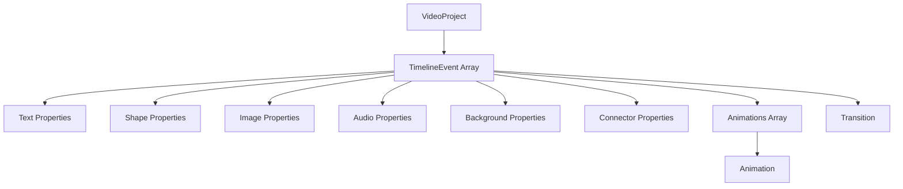

# Data Schemas - Understanding the Data Structures

> **Prerequisites**: Read [00-overview.md](./00-overview.md) first.
>
> **Key File**: [`src/lib/schemas/timeline.ts`](file:///c:/Users/kiran/code/p/videographic/videographic%20nextjs/src/lib/schemas/timeline.ts)

---

## 🎯 What You'll Learn

- The `VideoProject` structure that holds all video data
- How `TimelineEvent` represents individual elements
- Property schemas for each element type
- Animation and transition definitions
- How Zod validation works

---

## 📚 Why Schemas Matter

In Videographic, **everything is data**. When you:

1. Create a video with AI → You get a `VideoProject` JSON
2. Edit an element → You update a `TimelineEvent`
3. Add an animation → You add to the `animations` array
4. Export to MP4 → The renderer reads the same data

Understanding the schemas means understanding how the entire app works.

---

## 🏗️ Schema Hierarchy



---

## 🎬 VideoProject Schema

The **root schema** containing all video settings and elements.

```typescript
// src/lib/schemas/timeline.ts (lines 122-132)

export const VideoProjectSchema = z.object({
  id: z.string(),                           // Unique identifier
  name: z.string(),                         // Project name shown in dashboard
  description: z.string().optional(),       // Optional description
  width: z.number().default(1920),          // Canvas width (px)
  height: z.number().default(1080),         // Canvas height (px)
  fps: z.number().default(30),              // Frames per second
  duration: z.number().min(0.1),            // Total video length (seconds)
  backgroundColor: z.string().default("#000000"), // Fallback bg color
  events: z.array(TimelineEventSchema),     // All elements in the video
});
```

### Field Explanations

| Field | Type | Default | Description |
|-------|------|---------|-------------|
| `id` | string | Required | UUID for the project |
| `name` | string | Required | Display name |
| `width` | number | 1920 | Video width in pixels |
| `height` | number | 1080 | Video height in pixels |
| `fps` | number | 30 | Frames per second for export |
| `duration` | number | Required | Total video length (min 0.1s) |
| `backgroundColor` | string | "#000000" | Hex color for background |
| `events` | array | Required | All timeline elements |

### Example

```json
{
  "id": "abc123",
  "name": "My First Video",
  "width": 1920,
  "height": 1080,
  "fps": 30,
  "duration": 10,
  "backgroundColor": "#1a1a2e",
  "events": [
    // TimelineEvent objects go here
  ]
}
```

---

## 📦 TimelineEvent Schema

Each element in the video is a **TimelineEvent**. This is the most important schema to understand.

```typescript
// src/lib/schemas/timeline.ts (lines 95-119)

export const TimelineEventSchema = z.object({
  id: z.string(),
  type: z.enum(["text", "shape", "image", "background", "audio", "connector"]),
  startTime: z.number().min(0),        // When element appears (seconds)
  duration: z.number().min(0.1),       // How long it's visible (seconds)
  layer: z.number().default(0),        // Z-index (0 = back, higher = front)
  properties: z.union([                // Type-specific properties
    TextPropertiesSchema,
    ShapePropertiesSchema,
    ImagePropertiesSchema,
    BackgroundPropertiesSchema,
    AudioPropertiesSchema,
    ConnectorPropertiesSchema,         // Inline in actual code
  ]),
  animations: z.array(AnimationSchema).optional(),  // Property animations
  transition: TransitionSchema.optional(),          // Entry/exit effects
});
```

### Event Types Explained

| Type | Description | Visible On Canvas? |
|------|-------------|-------------------|
| `text` | Text labels, titles, captions | ✅ Yes |
| `shape` | Rectangles, circles, triangles | ✅ Yes |
| `image` | External images via URL | ✅ Yes |
| `background` | Full-canvas backgrounds | ✅ Yes (behind everything) |
| `audio` | Sound files or TTS | ❌ No (audio only) |
| `connector` | Lines/arrows between elements | ✅ Yes |

### Time & Layer Concepts

```
Timeline (seconds):  0    1    2    3    4    5
                     |----|----|----|----|----| 

Event A:             [=======]                   startTime: 0, duration: 2
Event B:                  [==========]           startTime: 1, duration: 3
Event C:                            [====]       startTime: 3.5, duration: 1.5

Layer Stack (z-index):
  Layer 2: Event C (front)
  Layer 1: Event B
  Layer 0: Event A (back)
```

---

## 📝 Text Properties

For `type: "text"` events.

```typescript
// src/lib/schemas/timeline.ts (lines 15-29)

export const TextPropertiesSchema = z.object({
  text: z.string(),                              // The actual text content
  fontSize: z.number().min(1),                   // Font size in pixels
  fontFamily: z.string().default("Inter"),       // Font name
  fontWeight: z.union([z.string(), z.number()]).default("normal"),
  fontStyle: z.enum(["normal", "italic"]).default("normal"),
  fill: z.string().default("#ffffff"),           // Text color (hex)
  stroke: z.string().optional(),                 // Outline color
  strokeWidth: z.number().optional(),            // Outline thickness
  textAlign: z.enum(["left", "center", "right"]).default("center"),
  opacity: z.number().min(0).max(1).default(1),  // 0 = invisible, 1 = solid
  x: z.number(),                                 // X position (pixels)
  y: z.number(),                                 // Y position (pixels)
  rotation: z.number().default(0),               // Rotation (degrees)
});
```

### Example Text Event

```json
{
  "id": "text-1",
  "type": "text",
  "startTime": 0,
  "duration": 3,
  "layer": 1,
  "properties": {
    "text": "Welcome to Videographic!",
    "fontSize": 72,
    "fontFamily": "Inter",
    "fontWeight": "bold",
    "fill": "#ffffff",
    "textAlign": "center",
    "opacity": 1,
    "x": 960,
    "y": 540,
    "rotation": 0
  }
}
```

---

## 🔷 Shape Properties

For `type: "shape"` events.

```typescript
// src/lib/schemas/timeline.ts (lines 32-50)

export const ShapePropertiesSchema = z.object({
  shapeType: z.enum(["rect", "circle", "ellipse", "triangle", "polygon"]),
  x: z.number(),
  y: z.number(),
  width: z.number().optional(),        // For rect, ellipse
  height: z.number().optional(),       // For rect, ellipse
  radius: z.number().optional(),       // For circle
  fill: z.string().default("#ffffff"),
  stroke: z.string().optional(),
  strokeWidth: z.number().optional(),
  opacity: z.number().min(0).max(1).default(1),
  rotation: z.number().default(0),
  cornerRadius: z.number().optional(), // Rounded corners for rect
  gradient: z.object({                 // Optional gradient fill
    type: z.enum(["linear", "radial"]),
    colors: z.array(z.string()),
    angle: z.number().optional(),
  }).optional(),
});
```

### Shape Types

| Shape | Required Props | Optional Props |
|-------|---------------|----------------|
| `rect` | x, y | width, height, cornerRadius |
| `circle` | x, y, radius | - |
| `ellipse` | x, y, width, height | - |
| `triangle` | x, y | width, height |
| `polygon` | x, y | width, height |

### Example Shape Event

```json
{
  "id": "shape-1",
  "type": "shape",
  "startTime": 0,
  "duration": 5,
  "layer": 0,
  "properties": {
    "shapeType": "circle",
    "x": 960,
    "y": 540,
    "radius": 100,
    "fill": "#8b5cf6",
    "stroke": "#ffffff",
    "strokeWidth": 3,
    "opacity": 1
  }
}
```

---

## 🖼️ Image Properties

For `type: "image"` events.

```typescript
// src/lib/schemas/timeline.ts (lines 53-62)

export const ImagePropertiesSchema = z.object({
  src: z.string().url(),               // Image URL (must be valid URL)
  x: z.number(),
  y: z.number(),
  width: z.number(),
  height: z.number(),
  opacity: z.number().min(0).max(1).default(1),
  rotation: z.number().default(0),
  fit: z.enum(["cover", "contain", "fill"]).default("cover"),
});
```

### Fit Modes

| Mode | Behavior |
|------|----------|
| `cover` | Image covers entire area, may crop |
| `contain` | Entire image visible, may have empty space |
| `fill` | Stretches to fill, may distort |

---

## 🔊 Audio Properties

For `type: "audio"` events.

```typescript
// src/lib/schemas/timeline.ts (lines 65-73)

export const AudioPropertiesSchema = z.object({
  src: z.string().url().optional(),    // URL to audio file
  prompt: z.string().optional(),       // For TTS generation (future)
  volume: z.number().min(0).max(1).default(1),
  isVoiceover: z.boolean().default(false),
  isMuted: z.boolean().default(false),
  fadeIn: z.number().optional(),       // Fade in duration (seconds)
  fadeOut: z.number().optional(),      // Fade out duration (seconds)
});
```

> **Note**: Audio playback is currently pending implementation.

---

## 🎨 Background Properties

For `type: "background"` events.

```typescript
// src/lib/schemas/timeline.ts (lines 76-85)

export const BackgroundPropertiesSchema = z.object({
  type: z.enum(["solid", "gradient", "image"]),
  color: z.string().optional(),        // For solid backgrounds
  gradient: z.object({
    type: z.enum(["linear", "radial"]),
    colors: z.array(z.string()),
    angle: z.number().optional(),
  }).optional(),
  image: z.string().url().optional(),  // For image backgrounds
});
```

### Background Type Examples

```json
// Solid color background
{
  "type": "solid",
  "color": "#1a1a2e"
}

// Gradient background
{
  "type": "gradient",
  "gradient": {
    "type": "linear",
    "colors": ["#1a1a2e", "#0f0e17"],
    "angle": 45
  }
}
```

---

## 🔗 Connector Properties

For `type: "connector"` events - lines/arrows between elements.

```typescript
// src/lib/schemas/timeline.ts (lines 107-115)

{
  sourceId: z.string(),              // ID of source element
  targetId: z.string(),              // ID of target element
  type: z.enum(["line", "arrow"]).default("arrow"),
  stroke: z.string().default("#ffffff"),
  strokeWidth: z.number().default(2),
  opacity: z.number().min(0).max(1).default(1),
}
```

---

## 🎭 Animation Schema

Animations define how properties change over time.

```typescript
// src/lib/schemas/timeline.ts (lines 4-12)

export const AnimationSchema = z.object({
  property: z.enum(["opacity", "scale", "x", "y", "rotation", "fill", "strokeWidth"]),
  from: z.number().or(z.string()),   // Starting value
  to: z.number().or(z.string()),     // Ending value
  easing: z.enum(["linear", "easeIn", "easeOut", "easeInOut", "bounce"]).optional(),
  duration: z.number().optional(),    // Override event duration
  delay: z.number().optional(),       // Wait before starting
  startTime: z.number().optional(),   // For DB compatibility
});
```

### Animatable Properties

| Property | From/To Type | Example |
|----------|-------------|---------|
| `opacity` | number (0-1) | 0 → 1 (fade in) |
| `scale` | number | 0.5 → 1 (grow) |
| `x` | number (pixels) | 0 → 960 (slide right) |
| `y` | number (pixels) | -100 → 540 (slide down) |
| `rotation` | number (degrees) | 0 → 360 (full spin) |
| `fill` | string (hex color) | "#ff0000" → "#00ff00" |
| `strokeWidth` | number (pixels) | 1 → 5 |

### Easing Functions

```
linear     ─────────────────  Constant speed
easeIn     ─────╱              Starts slow, ends fast  
easeOut          ╲─────────  Starts fast, ends slow
easeInOut  ─────╱╲─────────  Smooth start and end
bounce     ─────╱│╲│╱───────  Bouncy effect at end
```

### Example Animation (Fade In + Slide Up)

```json
"animations": [
  {
    "property": "opacity",
    "from": 0,
    "to": 1,
    "easing": "easeOut",
    "duration": 0.5
  },
  {
    "property": "y",
    "from": 600,
    "to": 540,
    "easing": "easeOut",
    "duration": 0.5
  }
]
```

---

## ✨ Transition Schema

Transitions are pre-defined effects for element entry/exit.

```typescript
// src/lib/schemas/timeline.ts (lines 88-92)

export const TransitionSchema = z.object({
  type: z.enum(["none", "fade", "slideLeft", "slideRight", "slideUp", "slideDown", "scale", "blur"]),
  duration: z.number().min(0).default(0.5),
  easing: z.enum(["linear", "easeIn", "easeOut", "easeInOut"]).default("easeInOut"),
});
```

### Transition Types

| Type | Effect |
|------|--------|
| `none` | No transition |
| `fade` | Fade in/out |
| `slideLeft` | Slide from right to left |
| `slideRight` | Slide from left to right |
| `slideUp` | Slide from bottom to top |
| `slideDown` | Slide from top to bottom |
| `scale` | Grow/shrink effect |
| `blur` | Blur in/out |

---

## 🔍 Understanding Zod Validation

[Zod](https://zod.dev) is a TypeScript-first schema validation library. Here's how it's used:

### Defining Schemas

```typescript
import { z } from "zod";

// Create a schema
const UserSchema = z.object({
  name: z.string(),
  age: z.number().min(0),
  email: z.string().email().optional(),
});
```

### Validating Data

```typescript
// This will throw if invalid
const validUser = UserSchema.parse({
  name: "John",
  age: 25,
});

// This returns { success, data, error }
const result = UserSchema.safeParse(unknownData);
if (result.success) {
  console.log(result.data);
} else {
  console.error(result.error);
}
```

### Inferring Types from Schemas

```typescript
// Automatically creates TypeScript type
type User = z.infer<typeof UserSchema>;
// Result: { name: string; age: number; email?: string }
```

### Why This Pattern?

1. **Single source of truth** - Schema defines both validation AND types
2. **Runtime safety** - AI-generated JSON is validated before use
3. **Type safety** - TypeScript catches errors at compile time
4. **Defaults** - `.default()` ensures required fields have fallbacks

---

## 📋 Type Exports

At the bottom of `timeline.ts`, types are exported for use throughout the app:

```typescript
// src/lib/schemas/timeline.ts (lines 134-147)

// Types - Output (Full objects with defaults applied)
export type Animation = z.infer<typeof AnimationSchema>;
export type TextProperties = z.infer<typeof TextPropertiesSchema>;
export type ShapeProperties = z.infer<typeof ShapePropertiesSchema>;
export type ImageProperties = z.infer<typeof ImagePropertiesSchema>;
export type AudioProperties = z.infer<typeof AudioPropertiesSchema>;
export type BackgroundProperties = z.infer<typeof BackgroundPropertiesSchema>;
export type Transition = z.infer<typeof TransitionSchema>;
export type TimelineEvent = z.infer<typeof TimelineEventSchema>;
export type VideoProject = z.infer<typeof VideoProjectSchema>;

// Types - Input (Optional fields allowed)
export type VideoProjectInput = z.input<typeof VideoProjectSchema>;
export type TimelineEventInput = z.input<typeof TimelineEventSchema>;
```

### `.infer` vs `.input`

| Type | Use Case |
|------|----------|
| `z.infer<T>` | Output type - after parsing (defaults applied) |
| `z.input<T>` | Input type - before parsing (optionals allowed) |

---

## 🧪 Practice: Identify the Schema

Look at this JSON and identify each part:

```json
{
  "id": "proj-1",
  "name": "Demo Video",
  "width": 1920,
  "height": 1080,
  "fps": 30,
  "duration": 5,
  "backgroundColor": "#000000",
  "events": [
    {
      "id": "text-1",
      "type": "text",
      "startTime": 0,
      "duration": 3,
      "layer": 1,
      "properties": {
        "text": "Hello World",
        "fontSize": 48,
        "fill": "#ffffff",
        "x": 960,
        "y": 540
      },
      "animations": [
        {
          "property": "opacity",
          "from": 0,
          "to": 1,
          "easing": "easeOut"
        }
      ]
    }
  ]
}
```

<details>
<summary>Answer (click to reveal)</summary>

- **Root**: `VideoProject`
- **`events[0]`**: `TimelineEvent` with type `"text"`
- **`events[0].properties`**: `TextProperties`
- **`events[0].animations[0]`**: `Animation` (opacity fade-in)

</details>

---

## 📚 Next Steps

Now that you understand the data structures, learn how users authenticate:

→ **[01-auth.md](./01-auth.md)** - Authentication System

---

*Understanding these schemas is fundamental - they're the common language between AI generation, editing, and export.*
