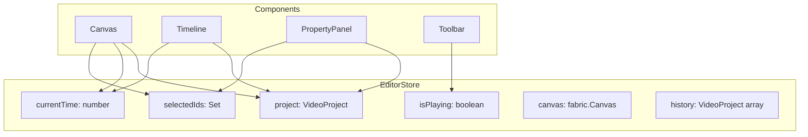
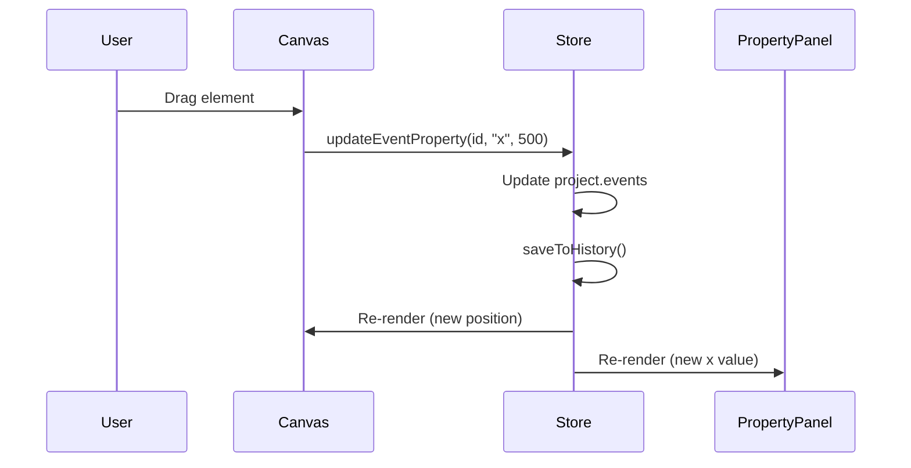

# State Management with Zustand

> **Prerequisites**: Read [11-database.md](./11-database.md) first.
>
> **Key File**: [`src/stores/editor-store.ts`](file:///c:/Users/kiran/code/p/videographic/videographic%20nextjs/src/stores/editor-store.ts)

---

## 🎯 What You'll Learn

- What Zustand is and why it's used
- The editor store structure
- All available state and actions
- Undo/redo implementation
- How components interact with state

---

## 📦 What is Zustand?

[Zustand](https://zustand-demo.pmnd.rs/) is a lightweight state management library for React. Key benefits:

| Feature | Description |
|---------|-------------|
| **Minimal API** | Just `create()` and hooks |
| **No boilerplate** | No reducers, actions files, or providers |
| **TypeScript support** | Full type inference |
| **Reactive** | Components re-render only when subscribed state changes |
| **Small bundle** | ~1KB gzipped |

### Comparison with Other Solutions

| Library | Complexity | Use Case |
|---------|------------|----------|
| **useState** | Simple | Local component state |
| **useContext** | Medium | Shared state, small apps |
| **Zustand** | Simple | Shared state, any size app |
| **Redux** | Complex | Large apps with strict patterns |

---

## 🏗️ Store Overview

The editor store manages all editor state in one place:



---

## 📋 State Structure

```typescript
// src/stores/editor-store.ts

interface EditorState {
  // Core state
  project: VideoProject | null;    // The video data
  currentTime: number;             // Playhead position (seconds)
  isPlaying: boolean;              // Is video playing?
  selectedIds: Set<string>;        // Selected element IDs
  canvas: fabric.Canvas | null;    // Fabric.js canvas instance

  // History (for undo/redo)
  history: VideoProject[];         // Past states
  historyIndex: number;            // Current position in history
  isUndoRedoing: boolean;          // Prevents history save during undo/redo

  // Backwards compatibility
  selectedId: string | null;       // First selected ID (getter)
}
```

### State Explained

| State | Type | Purpose |
|-------|------|---------|
| `project` | VideoProject | Complete video data |
| `currentTime` | number | Where the playhead is (seconds) |
| `isPlaying` | boolean | Controls animation playback |
| `selectedIds` | Set<string> | Multi-selection support |
| `canvas` | fabric.Canvas | Direct canvas access for operations |
| `history` | VideoProject[] | Last 50 project states |
| `historyIndex` | number | Current position for undo/redo |

---

## 🔧 Creating the Store

The store is created using Zustand's `create` function:

```typescript
// src/stores/editor-store.ts

import { create } from "zustand";

export const useEditorStore = create<EditorState>((set, get) => ({
  // Initial state
  project: null,
  currentTime: 0,
  isPlaying: false,
  selectedIds: new Set<string>(),
  canvas: null,
  history: [],
  historyIndex: -1,
  isUndoRedoing: false,

  // Actions (defined below)
  setProject: (project) => { ... },
  updateEvent: (id, updates) => { ... },
  // ...
}));
```

### Key Concepts

| Parameter | Purpose |
|-----------|---------|
| `set` | Update state (triggers re-renders) |
| `get` | Read current state without subscribing |

---

## ⚡ Actions Reference

### Project Actions

```typescript
// Set the entire project (resets history)
setProject: (project: VideoProject) => void

// Usage
useEditorStore.getState().setProject(loadedProject);
```

### Playback Actions

```typescript
// Update playhead position
setCurrentTime: (time: number) => void

// Toggle play/pause
setIsPlaying: (isPlaying: boolean) => void

// Usage
const { setCurrentTime, setIsPlaying } = useEditorStore();
setCurrentTime(2.5);  // Go to 2.5 seconds
setIsPlaying(true);   // Start playing
```

### Selection Actions

```typescript
// Select a single element (clears others)
setSelectedId: (id: string | null) => void

// Set multiple selections
setSelectedIds: (ids: Set<string>) => void

// Toggle with multi-select (Ctrl+click)
toggleSelectedId: (id: string, isMultiSelect: boolean) => void

// Clear all selections
clearSelection: () => void
```

### Event Mutation Actions

```typescript
// Update any properties of an event
updateEvent: (id: string, updates: Partial<TimelineEvent>) => void

// Update a specific property
updateEventProperty: (id: string, property: string, value: unknown) => void

// Add a new event
addEvent: (event: TimelineEvent) => void

// Duplicate selected events
duplicateSelectedEvents: () => void

// Delete an event
deleteEvent: (id: string) => void

// Delete all selected events
deleteSelectedEvents: () => void

// Reorder layers
reorderLayers: (fromIndex: number, toIndex: number) => void

// Set specific layer
setEventLayer: (id: string, layer: number) => void
```

### Alignment Actions

```typescript
// Center selected elements on canvas
centerSelectedEvents: () => void
centerSelectedEventsHorizontally: () => void
centerSelectedEventsVertically: () => void
```

### History Actions

```typescript
// Undo last change
undo: () => void

// Redo last undone change
redo: () => void

// Check if undo/redo is available
canUndo: () => boolean
canRedo: () => boolean

// Manually save to history
saveToHistory: () => void
```

---

## 🔄 Undo/Redo Implementation

The store maintains a history of project states:

```typescript
// saveToHistory - called after mutations
saveToHistory: () => {
  const { project, history, historyIndex } = get();
  if (!project) return;

  // Truncate future history if we undid and made a new change
  const newHistory = history.slice(0, historyIndex + 1);
  
  // Add current state as deep copy
  newHistory.push(JSON.parse(JSON.stringify(project)));

  // Limit to 50 states
  if (newHistory.length > 50) {
    newHistory.shift();
  }

  set({
    history: newHistory,
    historyIndex: newHistory.length - 1,
  });
}
```

### Undo

```typescript
undo: () => {
  const { history, historyIndex } = get();
  if (historyIndex > 0) {
    const newIndex = historyIndex - 1;
    set({
      project: JSON.parse(JSON.stringify(history[newIndex])),
      historyIndex: newIndex,
      isUndoRedoing: true,  // Prevent saving this as a new history entry
    });
    setTimeout(() => set({ isUndoRedoing: false }), 0);
  }
}
```

### Why Deep Copy?

```typescript
// Uses JSON.parse(JSON.stringify(...)) for deep copy
newHistory.push(JSON.parse(JSON.stringify(project)));
```

This ensures:
- History entries are independent of current state
- Mutations don't affect past history entries
- Each undo/redo gives a fresh object

---

## 🖥️ Using the Store in Components

### In Functional Components

```typescript
"use client";

import { useEditorStore } from "@/stores/editor-store";

export function Timeline() {
  // Subscribe to specific state (re-renders only when these change)
  const project = useEditorStore((state) => state.project);
  const currentTime = useEditorStore((state) => state.currentTime);
  const setCurrentTime = useEditorStore((state) => state.setCurrentTime);

  // Or get multiple values at once
  const { isPlaying, setIsPlaying } = useEditorStore();

  // Render using state
  return (
    <div>
      <span>{currentTime}s</span>
      <button onClick={() => setIsPlaying(!isPlaying)}>
        {isPlaying ? "Pause" : "Play"}
      </button>
    </div>
  );
}
```

### Selective Subscriptions

```typescript
// ✅ Good - only re-renders when currentTime changes
const currentTime = useEditorStore((state) => state.currentTime);

// ⚠️ Less optimal - re-renders when ANY state changes
const state = useEditorStore();
```

### Outside React (e.g., callbacks, utilities)

```typescript
// Get state directly
const project = useEditorStore.getState().project;

// Update state directly
useEditorStore.getState().setCurrentTime(5);

// Subscribe to changes
const unsubscribe = useEditorStore.subscribe(
  (state) => console.log("State changed:", state)
);
```

---

## 📍 Example: Update Event Flow

When a user drags an element on the canvas:



```typescript
// In Canvas component
const handleObjectMoving = (e: fabric.IEvent) => {
  const obj = e.target;
  if (!obj || !obj.data?.id) return;

  useEditorStore.getState().updateEventProperty(
    obj.data.id,
    "x",
    obj.left
  );
  useEditorStore.getState().updateEventProperty(
    obj.data.id,
    "y",
    obj.top
  );
};
```

---

## 🔍 Common Patterns

### Pattern 1: Batch Updates

```typescript
// Multiple updates - each triggers re-render
updateEventProperty(id, "x", 100);
updateEventProperty(id, "y", 200);

// Better: Single update with all changes
updateEvent(id, {
  properties: { ...event.properties, x: 100, y: 200 }
});
```

### Pattern 2: Conditional History Saving

```typescript
// Actions that should save to history call saveToHistory()
addEvent: (event) => {
  set((state) => { ... });
  get().saveToHistory();  // ← Save after mutation
}

// Actions that shouldn't (like playback) don't call it
setCurrentTime: (currentTime) => set({ currentTime }),
```

### Pattern 3: Derived State

```typescript
// selectedId is computed from selectedIds
get selectedId() {
  const ids = get().selectedIds;
  return ids.size > 0 ? Array.from(ids)[0] : null;
}
```

---

## 🐛 Debugging

### Log State Changes

```typescript
// In development
useEditorStore.subscribe((state) => {
  console.log("Store updated:", state);
});
```

### Access State in DevTools

```typescript
// In browser console
window.__ZUSTAND_STORE__ = useEditorStore;
// Then: __ZUSTAND_STORE__.getState()
```

### Common Issues

| Issue | Cause | Solution |
|-------|-------|----------|
| Component not updating | Not subscribed to correct state | Use selective subscription |
| Too many re-renders | Subscribing to entire store | Use `(state) => state.specificValue` |
| Undo not working | Forgot to call `saveToHistory()` | Add after mutations |
| Stale state in callback | Closure over old state | Use `get()` instead of closed-over value |

---

## 📚 Next Steps

Now that you understand state management, learn how the canvas renders:

→ **[04-fabric-canvas.md](./04-fabric-canvas.md)** - Canvas Rendering with Fabric.js

---

*State flows from the store to all components - understanding this is key to understanding the editor.*
