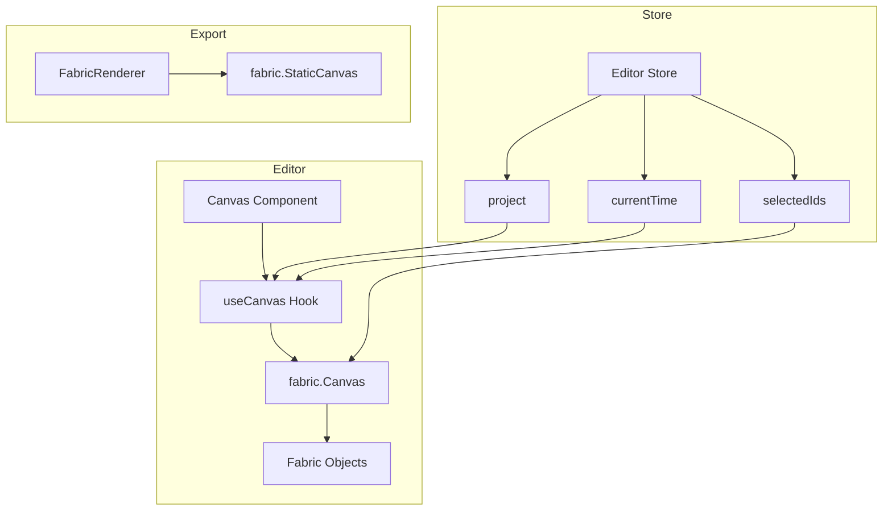

# Canvas Rendering with Fabric.js

> **Prerequisites**: Read [03-state-management.md](./03-state-management.md) first.
>
> **Key Files**:
> - [`src/components/editor/Canvas.tsx`](file:///c:/Users/kiran/code/p/videographic/videographic%20nextjs/src/components/editor/Canvas.tsx) - Canvas component
> - [`src/components/editor/hooks/useCanvas.ts`](file:///c:/Users/kiran/code/p/videographic/videographic%20nextjs/src/components/editor/hooks/useCanvas.ts) - Canvas logic hook
> - [`src/lib/core/FabricRenderer.ts`](file:///c:/Users/kiran/code/p/videographic/videographic%20nextjs/src/lib/core/FabricRenderer.ts) - Export renderer

---

## 🎯 What You'll Learn

- What Fabric.js is and how it's used
- Canvas initialization and lifecycle
- How TimelineEvents become Fabric objects
- User interaction handling (selection, drag, resize)
- Animation rendering at each point in time
- The difference between editor canvas and export renderer

---

## 📦 What is Fabric.js?

[Fabric.js](http://fabricjs.com/) is an HTML5 canvas library that provides:

| Feature | Description |
|---------|-------------|
| **Object Model** | Work with objects (Rect, Circle, Text) instead of pixels |
| **Selection** | Click-to-select, multi-select, bounding boxes |
| **Transformations** | Drag, resize, rotate with handles |
| **Serialization** | Export/import canvas state as JSON |
| **SVG Support** | Import and export SVG |

### Why Fabric.js for Video Editing?

- **Interactive editing** - Users can click, drag, and resize elements
- **Object persistence** - Elements maintain their properties across frames
- **Efficient rendering** - Only redraws changed objects
- **Export-ready** - Canvas contents can be captured frame-by-frame

---

## 🏗️ Architecture Overview



### Two Canvas Systems

| Canvas | Purpose | Interactivity |
|--------|---------|--------------|
| **fabric.Canvas** | Editor display | Yes - selection, drag, resize |
| **fabric.StaticCanvas** | Video export | No - just rendering |

---

## 🖼️ Canvas Component

The `Canvas.tsx` component is a simple wrapper:

```typescript
// src/components/editor/Canvas.tsx

export function Canvas() {
  const containerRef = useRef<HTMLDivElement>(null);
  const canvasRef = useCanvas(containerRef);  // Custom hook does the work
  const { canvas, selectedIds } = useEditorStore();

  return (
    <div ref={containerRef} className="...">
      <canvas
        ref={canvasRef}
        style={{
          boxShadow: "...",
          borderRadius: "8px",
        }}
      />
      {/* Context menu for right-click */}
      {contextMenu && <ContextMenu ... />}
    </div>
  );
}
```

The heavy lifting is in the `useCanvas` hook.

---

## 🪝 The useCanvas Hook

This hook manages the entire canvas lifecycle:

### 1. Initialization

```typescript
// src/components/editor/hooks/useCanvas.ts

useEffect(() => {
  if (!canvasRef.current) return;

  // Create Fabric canvas
  const fabricCanvas = new fabric.Canvas(canvasRef.current, {
    width: 1920,
    height: 1080,
    backgroundColor: "#000000",
    selection: true,              // Enable multi-selection
    preserveObjectStacking: true, // Maintain layer order on selection
  });

  // Store reference in Zustand
  setCanvas(fabricCanvas);

  // ... event handlers and resize observer

  return () => {
    fabricCanvas.dispose();
  };
}, []);
```

### 2. Event Handlers

```typescript
// Selection events
fabricCanvas.on("selection:created", (e) => {
  const selected = e.selected?.[0];
  if (selected?.data?.id) {
    setSelectedId(selected.data.id);
  }
});

fabricCanvas.on("selection:cleared", () => {
  setSelectedId(null);
});

// Modification events (drag, resize, rotate)
fabricCanvas.on("object:modified", (e) => {
  const target = e.target;
  if (!target?.data?.id) return;

  // Update store with new position
  updateEventProperty(target.data.id, "x", target.left);
  updateEventProperty(target.data.id, "y", target.top);

  // Handle shape-specific modifications...
});
```

### 3. Responsive Sizing

```typescript
const resizeObserver = new ResizeObserver(() => {
  const container = containerRef.current;
  if (!container) return;

  // Calculate zoom to fit 1920x1080 in container
  const widthRatio = container.clientWidth / 1920;
  const heightRatio = container.clientHeight / 1080;
  const ratio = Math.min(widthRatio, heightRatio);

  fabricCanvas.setDimensions({
    width: Math.floor(1920 * ratio),
    height: Math.floor(1080 * ratio),
  });
  fabricCanvas.setZoom(ratio);
});
```

---

## 🔄 Rendering TimelineEvents

Each time `project` or `currentTime` changes, the canvas updates:

```typescript
useEffect(() => {
  const canvas = useEditorStore.getState().canvas;
  if (!canvas || !project) return;

  // Update background color
  canvas.backgroundColor = project.backgroundColor;

  // Render each visible event
  project.events.forEach((event) => {
    // Check visibility based on current time
    const isVisible =
      currentTime >= event.startTime &&
      currentTime <= event.startTime + event.duration;
    
    if (!isVisible) return;

    // Calculate animated properties at current time
    const props = computeAnimatedProperties(event, currentTime);

    // Create or update Fabric object
    renderEventToCanvas(event, props, canvas);
  });

  canvas.renderAll();
}, [project, currentTime]);
```

---

## 🎭 Computing Animated Properties

When rendering, animations are interpolated based on current time:

```typescript
function computeAnimatedProperties(
  event: TimelineEvent,
  currentTime: number
): Record<string, unknown> {
  const properties = { ...event.properties };

  if (!event.animations?.length) return properties;

  const localTime = currentTime - event.startTime;

  for (const animation of event.animations) {
    const value = interpolateAnimation(animation, localTime, event.duration);
    if (value !== null) {
      properties[animation.property] = value;
    }
  }

  return properties;
}
```

### Interpolation Logic

```typescript
function interpolateAnimation(
  animation: Animation,
  localTime: number,
  eventDuration: number
): number | string | null {
  const animDuration = animation.duration ?? eventDuration;
  const startTime = animation.delay ?? 0;

  // Before animation starts
  if (localTime < startTime) return animation.from;

  // After animation ends
  if (localTime >= startTime + animDuration) return animation.to;

  // During animation - calculate progress
  const progress = (localTime - startTime) / animDuration;
  const easedProgress = easingFunctions[animation.easing](progress);

  // Interpolate numeric values
  if (typeof animation.from === "number") {
    return animation.from + (animation.to - animation.from) * easedProgress;
  }

  // For colors/strings - switch at midpoint
  return progress < 0.5 ? animation.from : animation.to;
}
```

### Easing Functions

```typescript
const easingFunctions = {
  linear: (t) => t,
  easeIn: (t) => t * t,
  easeOut: (t) => t * (2 - t),
  easeInOut: (t) => (t < 0.5 ? 2 * t * t : -1 + (4 - 2 * t) * t),
  bounce: (t) => { /* bouncing formula */ },
};
```

---

## 🔷 Creating Fabric Objects

### Text Elements

```typescript
if (event.type === "text") {
  const fabricObj = new fabric.Textbox(props.text || "", {
    left: props.x,
    top: props.y,
    originX: "center",
    originY: "center",
    fontSize: props.fontSize,
    fontFamily: props.fontFamily || "Inter",
    fill: props.fill || "#ffffff",
    textAlign: props.textAlign || "center",
    opacity: props.opacity ?? 1,
    angle: props.rotation || 0,
    width: 600,  // Default text width
    editable: false,  // Enable on double-click
  });

  fabricObj.data = { id: event.id, layer: event.layer };
  canvas.add(fabricObj);
}
```

### Shape Elements

```typescript
if (event.type === "shape") {
  const commonProps = {
    left: props.x,
    top: props.y,
    originX: "center",
    originY: "center",
    fill: props.fill || "#8b5cf6",
    opacity: props.opacity ?? 1,
    angle: props.rotation || 0,
  };

  let fabricObj;

  switch (props.shapeType) {
    case "rect":
      fabricObj = new fabric.Rect({
        ...commonProps,
        width: props.width || 100,
        height: props.height || 100,
        rx: props.cornerRadius || 0,
        ry: props.cornerRadius || 0,
      });
      break;

    case "circle":
      fabricObj = new fabric.Circle({
        ...commonProps,
        radius: props.radius || 50,
      });
      break;

    case "ellipse":
      fabricObj = new fabric.Ellipse({
        ...commonProps,
        rx: (props.width || 100) / 2,
        ry: (props.height || 50) / 2,
      });
      break;
  }

  fabricObj.data = { id: event.id, layer: event.layer };
  canvas.add(fabricObj);
}
```

---

## 🔗 Data Binding Pattern

Each Fabric object stores its event ID in `.data`:

```typescript
fabricObj.data = { 
  id: event.id,      // Links back to TimelineEvent
  layer: event.layer // For z-index ordering
};
```

This enables:
- **Selection** - When user clicks, we know which event is selected
- **Updates** - When canvas object moves, we update the right event
- **Object reuse** - Find existing object by ID instead of recreating

---

## 🎨 Object Reuse for Performance

Instead of recreating objects every frame, the hook reuses existing ones:

```typescript
// Collect existing objects by ID
const existingObjects: Record<string, fabric.Object> = {};
canvas.getObjects().forEach((obj) => {
  if (obj.data?.id) {
    existingObjects[obj.data.id] = obj;
  }
});

// When rendering an event
if (existingObjects[event.id]) {
  // Reuse and update properties
  existingObjects[event.id].set({
    left: props.x,
    top: props.y,
    opacity: props.opacity,
    // ...
  });
  delete existingObjects[event.id];  // Mark as used
} else {
  // Create new object
  const fabricObj = new fabric.Textbox(...);
  canvas.add(fabricObj);
}

// Remove objects no longer visible
Object.values(existingObjects).forEach((obj) => {
  canvas.remove(obj);
});
```

---

## 📍 Coordinate System

```
Canvas Coordinates (1920 x 1080)
┌────────────────────────────────────┐
│ (0,0)                      (1920,0)│
│                                    │
│           (960, 540)               │  ← Center
│              •                     │
│                                    │
│ (0,1080)                (1920,1080)│
└────────────────────────────────────┘
```

- **Origin**: Top-left is (0, 0)
- **Units**: Pixels
- **Object Origin**: Center (set via `originX: "center"`)
- **Zoom**: Canvas is scaled to fit container, but coordinates stay 1920x1080

---

## 🎬 FabricRenderer for Export

During video export, a separate `StaticCanvas` is used:

```typescript
// src/lib/core/FabricRenderer.ts

export class FabricRenderer {
  private canvas: fabric.StaticCanvas | null = null;
  private project: VideoProject;

  constructor(project: VideoProject) {
    this.project = project;
  }

  async initialize(): Promise<void> {
    const canvasEl = document.createElement("canvas");
    canvasEl.width = this.project.width;
    canvasEl.height = this.project.height;

    this.canvas = new fabric.StaticCanvas(canvasEl, {
      width: this.project.width,
      height: this.project.height,
      backgroundColor: this.project.backgroundColor || "#000000",
    });
  }

  renderFrame(frameState: FrameState): void {
    this.canvas.clear();
    this.canvas.backgroundColor = this.project.backgroundColor;

    for (const eventState of frameState.events) {
      this.renderEvent(eventState);
    }

    this.canvas.renderAll();
  }

  getCanvas(): HTMLCanvasElement {
    return this.canvas.getElement();
  }

  destroy(): void {
    this.canvas?.dispose();
  }
}
```

### Why StaticCanvas?

- **No interaction** - Export doesn't need selection/drag
- **No events** - Faster rendering without event handlers
- **Off-screen** - Canvas element isn't in DOM

---

## 🐛 Common Issues

| Issue | Cause | Solution |
|-------|-------|----------|
| Objects not updating | Not calling `setCoords()` | Call after position changes |
| Selection lags | Multiple re-renders | Debounce or batch updates |
| Objects jumping | Scale not reset | Set `scaleX/Y: 1` after resize |
| Text not editable | `editable: false` | Enable on double-click |
| Wrong z-order | Layer not respected | Sort by layer before rendering |

---

## 📊 Performance Tips

1. **Batch Updates** - Don't call `renderAll()` after each change
2. **Reuse Objects** - Update properties instead of recreating
3. **Limit Re-renders** - Only update when `project` or `currentTime` changes
4. **Disable Events During Updates** - Prevent selection events during canvas rebuild

---

## 📚 Next Steps

Now that you understand canvas rendering, learn about animations:

→ **[05-animation-engine.md](./05-animation-engine.md)** - Animation Engine

---

*The canvas is where data becomes visual - understanding this bridge is key to the editor.*
