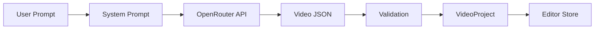

# AI Generation System

> **Prerequisites**: Read [06-render-export.md](./06-render-export.md) first.
>
> **Key Files**:
> - [`src/lib/ai/prompts.ts`](file:///c:/Users/kiran/code/p/videographic/videographic%20nextjs/src/lib/ai/prompts.ts) - System prompt and validation
> - [`src/lib/ai/openrouter.ts`](file:///c:/Users/kiran/code/p/videographic/videographic%20nextjs/src/lib/ai/openrouter.ts) - API integration
> - [`src/components/editor/AIGenerateModal.tsx`](file:///c:/Users/kiran/code/p/videographic/videographic%20nextjs/src/components/editor/AIGenerateModal.tsx) - Generation UI

---

## 🎯 What You'll Learn

- How AI-generated videos work
- The system prompt structure
- OpenRouter API integration
- JSON recovery for truncated responses
- Validation and normalization

---

## 🧠 AI Generation Overview

Users describe videos in natural language, and AI returns a complete `VideoProject`:



---

## 📝 System Prompt

The system prompt teaches the AI how to generate valid video projects:

```typescript
// src/lib/ai/prompts.ts

export const SYSTEM_PROMPT = `You are a professional video scene generator AI...

OUTPUT FORMAT:
You must respond with ONLY valid JSON matching this schema:

{
  "name": "Project Name",
  "width": 1920,
  "height": 1080,
  "fps": 30,
  "duration": 5,
  "backgroundColor": "#000000",
  "events": [
    {
      "id": "unique-id",
      "type": "text" | "shape",
      "startTime": 0,
      "duration": 5,
      "layer": 0,
      "properties": { ... },
      "animations": [ ... ]
    }
  ]
}

TYPES AND PROPERTIES:

1. TEXT TYPE:
{
  "type": "text",
  "properties": {
    "text": "Your text here",
    "fontSize": 48,
    "fontFamily": "Inter",
    "fill": "#ffffff",
    "x": 960,
    "y": 540
  }
}

2. SHAPE TYPE (rect, circle, ellipse, line, arrow, triangle):
{
  "type": "shape",
  "properties": {
    "shapeType": "rect",
    "x": 960,
    "y": 540,
    "width": 200,
    "height": 100,
    "fill": "#8b5cf6"
  }
}
...
`;
```

### Key Prompt Sections

| Section | Purpose |
|---------|---------|
| Output Format | JSON schema for VideoProject |
| Types and Properties | All element types and their properties |
| Professional Video Structure | 3-act structure (intro, content, outro) |
| Visual Depth & Detail | Layering and visual effects guidelines |
| Animation Easing Reference | When to use each easing function |
| Positioning Rules | Coordinate system explanation |
| Color Palette | Premium color suggestions |

---

## 🎬 Video Structure Guidelines

The prompt enforces a professional 3-act structure:

### 1. Intro (15% of duration)
```
- Fade in background first (layer 0)
- Animate title with scale (0.8→1) + opacity (0→1)
- Add decorative accent shapes (low opacity glows on layer 1)
- Hold title visible for at least 1 second
```

### 2. Content (70% of duration)
```
- Stagger element entries by 0.1-0.3s
- Use varied animations: x, y, scale, opacity, rotation
- Keep key text visible for at least 2 seconds
- For 15s+ videos, create distinct content sections
```

### 3. Outro (15% of duration)
```
- ALL foreground elements MUST have exit animations
- Start exits at approximately (duration - 1.5s)
- Exit: opacity 1→0 with easing "easeIn"
- Stagger element exits by 0.1-0.2s
- Background fades last
```

---

## 🔌 OpenRouter Integration

The API client handles the OpenRouter chat completions API:

```typescript
// src/lib/ai/openrouter.ts

export async function generateWithOpenRouter(
  prompt: string,
  apiKey: string,
  model: string = "minimax/minimax-m2.1",
  duration: number = 5
): Promise<GenerationResult> {
  const response = await fetch("https://openrouter.ai/api/v1/chat/completions", {
    method: "POST",
    headers: {
      "Content-Type": "application/json",
      "Authorization": `Bearer ${apiKey}`,
      "HTTP-Referer": process.env.NEXT_PUBLIC_APP_URL,
      "X-Title": "Videographic",
    },
    body: JSON.stringify({
      model,
      messages: [
        { role: "system", content: SYSTEM_PROMPT },
        { role: "user", content: buildUserPrompt(prompt, duration) },
      ],
      temperature: 0.7,
      max_tokens: 16000,
      stream: true,  // For long responses
    }),
  });

  // Stream handling for chunked responses
  const reader = response.body?.getReader();
  let fullText = "";

  while (true) {
    const { done, value } = await reader.read();
    if (done) break;
    // Accumulate chunks...
  }

  // Parse and validate
  const project = validateGeneratedProject(JSON.parse(fullText));
  return { success: true, project };
}
```

---

## 📨 User Prompt Builder

Constructs the user message with duration and reminders:

```typescript
export function buildUserPrompt(description: string, duration: number = 5): string {
  return `Create a professional video scene based on this description: "${description}"

VIDEO DURATION: ${duration} seconds

CRITICAL REMINDERS:
1. ALL visible elements MUST have exit animations ending before ${duration}s
2. Use staggered timing (don't start everything at once)
3. Add visual depth with glow shapes (low opacity circles/rects on layer 1)
4. Smooth outro is MANDATORY - no abrupt element disappearances

Remember: Output ONLY the JSON object, no other text.`;
}
```

---

## 🔄 JSON Recovery

Since AI responses can be truncated, the system attempts to repair invalid JSON:

```typescript
function attemptJSONRecovery(truncatedJson: string): string {
  let openBraces = 0;
  let openBrackets = 0;

  // Count unclosed brackets/braces
  for (const char of truncatedJson) {
    if (char === '{') openBraces++;
    if (char === '}') openBraces--;
    if (char === '[') openBrackets++;
    if (char === ']') openBrackets--;
  }

  let repaired = truncatedJson.trim();

  // Remove trailing commas
  if (repaired.endsWith(',')) {
    repaired = repaired.slice(0, -1);
  }

  // Add missing closing brackets
  while (openBrackets > 0) {
    repaired += ']';
    openBrackets--;
  }

  while (openBraces > 0) {
    repaired += '}';
    openBraces--;
  }

  return repaired;
}
```

---

## ✅ Validation

After parsing, the project is validated and normalized:

```typescript
export function validateGeneratedProject(data: unknown): VideoProject | null {
  if (!data || typeof data !== "object") return null;
  
  const project = data as Record<string, unknown>;
  
  // Required fields
  if (!project.name || !project.duration || !Array.isArray(project.events)) {
    return null;
  }

  // Normalize each event
  const events = project.events.map((event, index) => {
    const e = event as Record<string, unknown>;
    
    const baseEvent = {
      id: e.id ? String(e.id) : `event-${index}`,
      type: String(e.type),
      startTime: Number(e.startTime) || 0,
      duration: Number(e.duration) || 5,
      layer: Number(e.layer) || 0,
      properties: normalizeProperties(e),
      animations: e.animations,
    };

    return baseEvent;
  });

  return {
    id: `project-${Date.now()}`,
    name: String(project.name),
    width: Number(project.width) || 1920,
    height: Number(project.height) || 1080,
    fps: Number(project.fps) || 30,
    duration: Number(project.duration) || 5,
    backgroundColor: String(project.backgroundColor) || "#000000",
    events,
  };
}
```

### Property Normalization

Each element type gets default values:

```typescript
if (baseEvent.type === "text") {
  baseEvent.properties = {
    text: String(props.text || "Text"),
    fontSize: Number(props.fontSize) || 48,
    fontFamily: String(props.fontFamily || "Inter"),
    fontWeight: props.fontWeight || "bold",
    fill: String(props.fill || "#ffffff"),
    x: Number(props.x) || 960,
    y: Number(props.y) || 540,
    textAlign: String(props.textAlign || "center"),
    opacity: props.opacity !== undefined ? Number(props.opacity) : 1,
  };
}
```

---

## 🤖 Available Models

```typescript
export const OPENROUTER_MODELS = {
  "minimax-m2.1": "minimax/minimax-m2.1",
} as const;
```

---

## 🖼️ Generation Modal

The UI component manages the generation flow:

```typescript
// In AIGenerateModal.tsx

const handleGenerate = async () => {
  setIsGenerating(true);
  setError(null);

  const result = await generateWithOpenRouter(
    prompt,
    apiKey,
    selectedModel,
    duration
  );

  if (result.success && result.project) {
    if (appendMode) {
      // Add events to existing project
      result.project.events.forEach((event) => {
        addEvent(event);
      });
    } else {
      // Replace project
      setProject(result.project);
    }
    onClose();
  } else {
    setError(result.error || "Generation failed");
  }

  setIsGenerating(false);
};
```

---

## 📊 Generation Result Interface

```typescript
interface GenerationResult {
  success: boolean;
  project?: VideoProject;
  error?: string;
  rawResponse?: string;  // For debugging
}
```

---

## 🐛 Debugging

When generation fails:

1. Check console for `[OpenRouter]` logs
2. Look at `rawResponse` in the result
3. Common issues:
   - API key invalid/expired
   - Response truncated (max_tokens too low)
   - Invalid JSON from model

---

## 📚 Next Steps

Learn about the API routes that power the application:

→ **[10-api-routes.md](./10-api-routes.md)** - API Routes

---

*AI generation is the magic that lets users describe videos in plain English - understanding this system helps you improve generation quality.*
