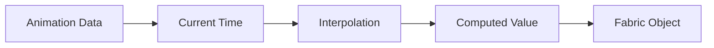

# Animation Engine

> **Prerequisites**: Read [06-fabric-canvas.md](./06-fabric-canvas.md) first.
>
> **Key Files**:
> - [`src/components/editor/hooks/useCanvas.ts`](file:///c:/Users/kiran/code/p/videographic/videographic%20nextjs/src/components/editor/hooks/useCanvas.ts) - Animation interpolation
> - [`src/lib/schemas/timeline.ts`](file:///c:/Users/kiran/code/p/videographic/videographic%20nextjs/src/lib/schemas/timeline.ts) - Animation/Transition schemas

---

## 🎯 What You'll Learn

- How animations are defined and stored
- The interpolation system
- Easing functions explained
- Transition effects for entry/exit
- How animations sync with playback
- Adding animations via the UI

---

## 🎬 Animation Overview

Videographic uses a **declarative animation system**:

1. **Define**: Animations are stored as data in `TimelineEvent.animations[]`
2. **Interpolate**: At each frame, properties are calculated based on time
3. **Apply**: Calculated values are applied to Fabric.js objects



---

## 📋 Animation Schema

Each animation defines how a property changes over time:

```typescript
// src/lib/schemas/timeline.ts

interface Animation {
  property: "opacity" | "scale" | "x" | "y" | "rotation" | "fill" | "strokeWidth";
  from: number | string;    // Starting value
  to: number | string;      // Ending value
  easing?: "linear" | "easeIn" | "easeOut" | "easeInOut" | "bounce";
  duration?: number;        // Override event duration (seconds)
  delay?: number;           // Wait before starting (seconds)
}
```

### Example: Fade In Animation

```json
{
  "property": "opacity",
  "from": 0,
  "to": 1,
  "easing": "easeOut",
  "duration": 0.5
}
```

### Example: Slide + Fade Combo

```json
"animations": [
  {
    "property": "opacity",
    "from": 0,
    "to": 1,
    "easing": "easeOut",
    "duration": 0.3
  },
  {
    "property": "y",
    "from": 600,
    "to": 540,
    "easing": "easeOut",
    "duration": 0.5
  }
]
```

---

## ⏱️ Time Model

Animations work with **local time** relative to the event:

```
Event Timeline:
|--- startTime ---|---------------------- duration ----------------------|
                  |                                                       |
                  0                    localTime                    event ends
                  
Global Timeline:  0      1      2      3      4      5      6      7
Event appears:                  |==============================|
                            startTime                   startTime + duration
```

### Local Time Calculation

```typescript
const localTime = currentTime - event.startTime;
```

If an event starts at `2s` and current playhead is at `3.5s`, `localTime = 1.5s`.

---

## 🔢 Interpolation Algorithm

The core animation logic:

```typescript
function interpolateAnimation(
  animation: Animation,
  localTime: number,
  eventDuration: number
): number | string | null {
  const animDuration = animation.duration ?? eventDuration;
  const startTime = animation.delay ?? 0;

  // Before animation starts - return starting value
  if (localTime < startTime) {
    return animation.from;
  }

  // After animation ends - return ending value
  if (localTime >= startTime + animDuration) {
    return animation.to;
  }

  // During animation - interpolate
  const progress = (localTime - startTime) / animDuration;
  const easingFn = easingFunctions[animation.easing] || easingFunctions.linear;
  const easedProgress = easingFn(progress);

  // Numeric interpolation
  if (typeof animation.from === "number" && typeof animation.to === "number") {
    return animation.from + (animation.to - animation.from) * easedProgress;
  }

  // Color/string interpolation - snap at midpoint
  return progress < 0.5 ? animation.from : animation.to;
}
```

### Progress Calculation

```
progress = (localTime - delay) / animationDuration

Example: animation with duration 2s, delay 0.5s
├── delay ──┼───────── animation ──────────┤
0          0.5                            2.5

At localTime = 1.5s:
progress = (1.5 - 0.5) / 2.0 = 0.5 (50% complete)
```

---

## 📈 Easing Functions

Easing makes animations feel natural:

```typescript
const easingFunctions = {
  linear: (t) => t,
  
  easeIn: (t) => t * t,
  
  easeOut: (t) => t * (2 - t),
  
  easeInOut: (t) => t < 0.5 
    ? 2 * t * t 
    : -1 + (4 - 2 * t) * t,
  
  bounce: (t) => {
    if (t < 1/2.75) return 7.5625 * t * t;
    if (t < 2/2.75) return 7.5625 * (t -= 1.5/2.75) * t + 0.75;
    if (t < 2.5/2.75) return 7.5625 * (t -= 2.25/2.75) * t + 0.9375;
    return 7.5625 * (t -= 2.625/2.75) * t + 0.984375;
  }
};
```

### Visual Comparison

```
Progress (t) →

linear:     ──────────────────────────────
            Constant speed

easeIn:     ─────────────────╱
            Slow start, fast end

easeOut:    ╱─────────────────────────────
            Fast start, slow end

easeInOut:  ─────────╱╲────────────────────
            Smooth start and end

bounce:     ─────╱│╲│╱────────────────────
            Bounces at end
```

---

## 🎭 Animatable Properties

| Property | Type | Example |
|----------|------|---------|
| `opacity` | 0-1 | Fade in: 0 → 1 |
| `scale` | number | Grow: 0.5 → 1 |
| `x` | pixels | Slide right: 0 → 960 |
| `y` | pixels | Slide down: 0 → 540 |
| `rotation` | degrees | Spin: 0 → 360 |
| `fill` | color | Color change: #ff0000 → #00ff00 |
| `strokeWidth` | pixels | Thicken: 1 → 5 |

---

## ✨ Transition System

Transitions are predefined effects for element entry/exit:

```typescript
interface Transition {
  type: "none" | "fade" | "slideLeft" | "slideRight" | "slideUp" | "slideDown" | "scale" | "blur";
  duration: number;      // seconds
  easing: "linear" | "easeIn" | "easeOut" | "easeInOut";
}
```

### Transition Types

| Type | Entry Effect | Exit Effect |
|------|-------------|-------------|
| `fade` | Opacity 0 → 1 | Opacity 1 → 0 |
| `slideLeft` | Moves in from right | Moves out to left |
| `slideRight` | Moves in from left | Moves out to right |
| `slideUp` | Moves in from bottom | Moves out to top |
| `slideDown` | Moves in from top | Moves out to bottom |
| `scale` | Grows from 0 | Shrinks to 0 |
| `blur` | Unblurs | Blurs out |

### Default Exit Animation

If no opacity animation exists, elements get a smooth exit:

```typescript
// Applied automatically in computeAnimatedProperties()
const hasOpacityAnimation = event.animations?.some(a => a.property === "opacity");

if (!hasOpacityAnimation) {
  const exitDuration = 0.8;  // seconds
  const timeUntilEnd = event.duration - localTime;
  
  if (timeUntilEnd <= exitDuration && timeUntilEnd > 0) {
    const exitProgress = 1 - (timeUntilEnd / exitDuration);
    const easedProgress = exitProgress * exitProgress;  // easeIn
    
    // Fade out
    properties.opacity = currentOpacity * (1 - easedProgress);
    
    // Slight scale down
    properties.scale = currentScale * (1 - easedProgress * 0.1);
  }
}
```

---

## 🔄 Animation During Playback

When video is playing, `currentTime` updates continuously:

```typescript
// In EditorClient.tsx
useEffect(() => {
  if (!isPlaying) return;

  let lastTime = performance.now();
  
  const animate = (time: number) => {
    const delta = (time - lastTime) / 1000;  // seconds
    lastTime = time;
    
    const newTime = Math.min(
      currentTime + delta,
      project.duration
    );
    
    setCurrentTime(newTime);
    
    if (newTime < project.duration) {
      animationFrameId = requestAnimationFrame(animate);
    } else {
      setIsPlaying(false);
    }
  };
  
  animationFrameId = requestAnimationFrame(animate);
  
  return () => cancelAnimationFrame(animationFrameId);
}, [isPlaying]);
```

Each frame:
1. Calculate new `currentTime`
2. Store triggers re-render
3. Canvas hook recalculates all animated properties
4. Objects update on canvas

---

## 🎛️ Adding Animations via UI

The PropertyPanel allows adding animations to selected elements:

```typescript
// In PropertyPanel.tsx

const handleAddAnimation = () => {
  updateEvent(selectedId, {
    animations: [
      ...(event.animations || []),
      {
        property: "opacity",
        from: 0,
        to: 1,
        easing: "easeOut",
        duration: 0.5,
      }
    ]
  });
};

const handleUpdateAnimation = (index: number, updates: Partial<Animation>) => {
  const animations = [...(event.animations || [])];
  animations[index] = { ...animations[index], ...updates };
  updateEvent(selectedId, { animations });
};

const handleRemoveAnimation = (index: number) => {
  const animations = [...(event.animations || [])];
  animations.splice(index, 1);
  updateEvent(selectedId, { animations });
};
```

---

## 📊 Animation Timeline Visualization

On the Timeline component, animations can be visualized:

```
Timeline Track:
├──────────────── Event Duration ─────────────────┤
│░░░░│▓▓▓▓▓▓▓▓▓▓▓▓▓▓▓▓▓▓▓▓▓▓▓▓▓▓▓▓▓▓▓▓▓▓▓│░░░░░░│
│delay│         animation duration         │ hold │

░ = Holding start/end value
▓ = Actively animating
```

---

## 🐛 Debugging Animations

### Log Animation Values

```typescript
const props = computeAnimatedProperties(event, currentTime);
console.log(`Event ${event.id} at t=${currentTime}:`, props);
```

### Check Animation State

```typescript
// Is animation active?
const localTime = currentTime - event.startTime;
const animStart = animation.delay ?? 0;
const animEnd = animStart + (animation.duration ?? event.duration);

const state = localTime < animStart 
  ? "waiting" 
  : localTime > animEnd 
    ? "complete" 
    : "active";
```

### Common Issues

| Issue | Cause | Solution |
|-------|-------|----------|
| Animation not playing | Wrong startTime/duration | Check event timing |
| Jumpy animation | Large time intervals | Use `requestAnimationFrame` |
| Animation resets | Event recreated | Use object reuse pattern |
| Wrong final value | Precision errors | Snap to `to` value at end |

---

## 🎨 Animation Best Practices

### 1. Stagger Multiple Elements

```json
// Element 1
{ "delay": 0, "duration": 0.5 }

// Element 2
{ "delay": 0.2, "duration": 0.5 }

// Element 3
{ "delay": 0.4, "duration": 0.5 }
```

### 2. Combine Properties

```json
"animations": [
  { "property": "opacity", "from": 0, "to": 1, "duration": 0.3 },
  { "property": "y", "from": 600, "to": 540, "duration": 0.5 },
  { "property": "scale", "from": 0.8, "to": 1, "duration": 0.4 }
]
```

### 3. Use Appropriate Easing

- **Entry**: `easeOut` (fast start, gentle landing)
- **Exit**: `easeIn` (slow start, fast departure)
- **Loops**: `linear` (constant speed)
- **Bounce**: `bounce` (playful emphasis)

---

## 🔧 Build Steps

The animation system is integrated into `useCanvas.ts`. Key additions:

| Component | File | Action |
|-----------|------|--------|
| Easing functions | `useCanvas.ts` | Add easing function object |
| Interpolation | `useCanvas.ts` | Add `interpolateAnimation()` function |
| Property computation | `useCanvas.ts` | Add `computeAnimatedProperties()` function |

Copy the interpolation and easing code from this doc into your `useCanvas.ts` hook.

---

## 📚 Next Steps

Now that you understand animations, learn about the timeline UI:

→ **[08-timeline-component.md](./08-timeline-component.md)** - Timeline Component

---

*Animations bring your video to life - smooth, well-timed motion is what makes videos feel professional.*
