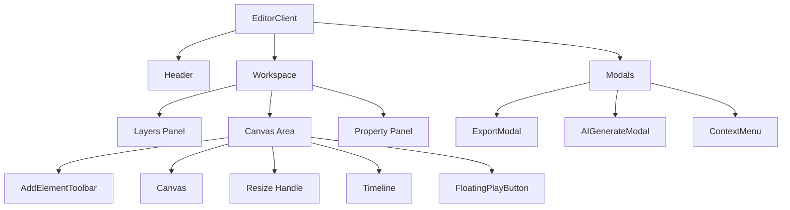
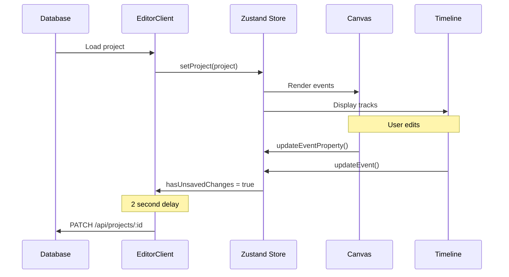

# Editor Architecture

> **Prerequisites**: Read [08-timeline-component.md](./08-timeline-component.md) first.
>
> **Key File**: [`src/components/editor/EditorClient.tsx`](file:///c:/Users/kiran/code/p/videographic/videographic%20nextjs/src/components/editor/EditorClient.tsx)

---

## 🎯 What You'll Learn

- Editor layout and component hierarchy
- Panel system (layers, timeline, properties)
- Project loading and auto-save
- Keyboard shortcuts
- Selection synchronization
- Preview mode

---

## 🏗️ Layout Overview

The editor uses a three-column layout with a resizable bottom panel:

```
┌─────────────────────────────────────────────────────────────────┐
│  Header: Project name │ Save status │ Panel toggles │ Export   │
├────────────┬────────────────────────────────────┬───────────────┤
│            │                                    │               │
│   Layers   │            Canvas                  │   Properties  │
│   Panel    │                                    │    Panel      │
│    240px   │           (flex-1)                 │     288px     │
│            │                                    │               │
├────────────┴─────────────────── ─ ─ ─ ─ ─ ─ ─ ─┴───────────────┤
│ ═══════════════ Resize Handle ════════════════                  │
├─────────────────────────────────────────────────────────────────┤
│                        Timeline Panel                           │
│                       (resizable height)                        │
└─────────────────────────────────────────────────────────────────┘
```

---

## 📦 Component Hierarchy



---

## 🔌 Component Responsibilities

| Component | Purpose |
|-----------|---------|
| `EditorClient` | Main container, state orchestration |
| `Canvas` | Fabric.js rendering |
| `Timeline` | Time-based track editor |
| `PropertyPanel` | Edit selected element properties |
| `AddElementToolbar` | Add shapes, text, images |
| `ExportModal` | Video export settings |
| `AIGenerateModal` | AI content generation |
| `ContextMenu` | Right-click actions |

---

## 📂 Project Loading

When the editor opens, it receives the project from the database:

```typescript
interface EditorProjectInput {
  id: string;
  name: string;
  description?: string;
  width: number;
  height: number;
  fps: number;
  duration: number;
  backgroundColor: string;
  events: TimelineEvent[];
}

export function EditorClient({ project: dbProject }: EditorClientProps) {
  // Load project into Zustand store
  useEffect(() => {
    const videoProject: VideoProject = {
      id: dbProject.id,
      name: dbProject.name,
      // ... other fields
      events: dbProject.events,
    };
    
    setProject(videoProject);
    lastSavedEventsRef.current = JSON.stringify(videoProject.events);
  }, [dbProject]);
}
```

---

## 💾 Auto-Save System

The editor auto-saves after 2 seconds of inactivity:

```typescript
// Track unsaved changes
useEffect(() => {
  const currentEvents = JSON.stringify(project.events);
  if (currentEvents !== lastSavedEventsRef.current) {
    setHasUnsavedChanges(true);
  }
}, [project?.events]);

// Auto-save after 2 seconds
useEffect(() => {
  if (!hasUnsavedChanges) return;

  const timeout = setTimeout(() => {
    saveProject();
  }, 2000);

  return () => clearTimeout(timeout);
}, [hasUnsavedChanges, project?.events]);
```

### Save Function

```typescript
const saveProject = async () => {
  setIsSaving(true);
  
  const timeline = project.events.map((event) => ({
    id: event.id,
    type: event.type,
    startTime: event.startTime,
    duration: event.duration,
    properties: event.properties,
    animations: event.animations,
  }));

  await fetch(`/api/projects/${project.id}`, {
    method: "PATCH",
    body: JSON.stringify({
      name: project.name,
      duration: project.duration,
      timeline,
    }),
  });

  setLastSaved(new Date());
  setHasUnsavedChanges(false);
};
```

### Unsaved Changes Warning

```typescript
useEffect(() => {
  const handleBeforeUnload = (e: BeforeUnloadEvent) => {
    if (hasUnsavedChanges) {
      e.preventDefault();
      e.returnValue = "You have unsaved changes...";
    }
  };

  window.addEventListener("beforeunload", handleBeforeUnload);
  return () => window.removeEventListener("beforeunload", handleBeforeUnload);
}, [hasUnsavedChanges]);
```

---

## ⌨️ Keyboard Shortcuts

The editor handles common keyboard shortcuts:

```typescript
useEffect(() => {
  const handleKeyDown = (e: KeyboardEvent) => {
    // Ctrl/Cmd + S = Save
    if ((e.ctrlKey || e.metaKey) && e.key === "s") {
      e.preventDefault();
      saveProject();
    }

    // Ctrl/Cmd + Z = Undo
    if ((e.ctrlKey || e.metaKey) && e.key === "z" && !e.shiftKey) {
      e.preventDefault();
      undo();
    }

    // Ctrl/Cmd + Shift + Z or Ctrl/Cmd + Y = Redo
    if ((e.ctrlKey || e.metaKey) && (e.shiftKey && e.key === "z" || e.key === "y")) {
      e.preventDefault();
      redo();
    }

    // Ctrl/Cmd + D = Duplicate
    if ((e.ctrlKey || e.metaKey) && e.key === "d") {
      e.preventDefault();
      duplicateSelectedEvents();
    }

    // Delete/Backspace = Delete selected
    if (e.key === "Delete" || e.key === "Backspace") {
      if (target.tagName !== "INPUT" && target.tagName !== "TEXTAREA") {
        deleteSelectedEvents();
      }
    }

    // Escape = Clear selection
    if (e.key === "Escape") {
      clearSelection();
    }

    // Ctrl/Cmd + E = Center selected
    if ((e.ctrlKey || e.metaKey) && e.key === "e") {
      centerSelectedEvents();
    }
  };

  window.addEventListener("keydown", handleKeyDown);
  return () => window.removeEventListener("keydown", handleKeyDown);
}, []);
```

### Shortcut Reference

| Shortcut | Action |
|----------|--------|
| `Ctrl+S` | Save project |
| `Ctrl+Z` | Undo |
| `Ctrl+Shift+Z` / `Ctrl+Y` | Redo |
| `Ctrl+D` | Duplicate selected |
| `Delete` / `Backspace` | Delete selected |
| `Escape` | Clear selection |
| `Ctrl+E` | Center selected |
| `Ctrl+Click` | Multi-select |

---

## 🎚️ Panel Visibility

Each panel can be toggled independently:

```typescript
const [showLayers, setShowLayers] = useState(true);
const [showProperties, setShowProperties] = useState(true);
const [showTimeline, setShowTimeline] = useState(true);

// Toggle buttons in header
<button onClick={() => setShowLayers(!showLayers)}>
  📑 Layers
</button>
<button onClick={() => setShowTimeline(!showTimeline)}>
  🎬 Timeline
</button>
<button onClick={() => setShowProperties(!showProperties)}>
  ⚙️ Properties
</button>
```

### Resizable Timeline

```typescript
const { height, handleMouseDown } = useResizable(200, 100, 600);

{showTimeline && (
  <>
    <div 
      className="h-1.5 cursor-ns-resize"
      onMouseDown={handleMouseDown}
    />
    <div style={{ height: `${height}px` }}>
      <Timeline />
    </div>
  </>
)}
```

---

## 👁️ Preview Mode

Preview mode hides all panels for distraction-free viewing:

```typescript
const [isPreviewMode, setIsPreviewMode] = useState(false);
const prevPanelStatesRef = useRef({ layers: true, properties: true, timeline: true });

const togglePreviewMode = () => {
  if (isPreviewMode) {
    // Exit: restore previous panel states
    setShowLayers(prevPanelStatesRef.current.layers);
    setShowProperties(prevPanelStatesRef.current.properties);
    setShowTimeline(prevPanelStatesRef.current.timeline);
    setIsPreviewMode(false);
  } else {
    // Enter: save states and hide all
    prevPanelStatesRef.current = { layers: showLayers, properties: showProperties, timeline: showTimeline };
    setShowLayers(false);
    setShowProperties(false);
    setShowTimeline(false);
    setIsPreviewMode(true);
  }
};
```

---

## 🔗 Selection Synchronization

When an item is selected in the Layers panel, the canvas selection updates:

```typescript
useEffect(() => {
  if (!canvas || !selectedId) return;

  const objects = canvas.getObjects();
  const targetObject = objects.find((obj) => obj.data?.id === selectedId);

  if (targetObject) {
    canvas.setActiveObject(targetObject);
    canvas.requestRenderAll();
  }
}, [selectedId, canvas]);
```

---

## 📑 Layers Panel

The layers panel shows all elements with drag-to-reorder:

```typescript
{project.events.reverse().map((event, idx) => (
  <div
    draggable
    onDragStart={(e) => {
      setDraggingIndex(idx);
      e.dataTransfer.setData("text/plain", String(idx));
    }}
    onDrop={(e) => {
      const fromIdx = parseInt(e.dataTransfer.getData("text/plain"));
      reorderLayers(fromIdx, targetIdx);
    }}
    onClick={(e) => toggleSelectedId(event.id, e.ctrlKey)}
  >
    <span>{getIcon(event.type)}</span>
    <span>{getLabel(event)}</span>
  </div>
))}
```

---

## 🎨 Empty Project State

When project has no events, show inline AI generator:

```typescript
const isProjectEmpty = project?.events.length === 0;

{isProjectEmpty ? (
  <div className="absolute inset-0 flex items-center justify-center">
    <AIGenerateModal isOpen={true} isInline={true} />
  </div>
) : (
  <>
    <AddElementToolbar />
    <Canvas />
  </>
)}
```

---

## 📊 Data Flow Summary



---

## 📚 Next Steps

Now understand the video export system:

→ **[06-render-export.md](./06-render-export.md)** - Video Export Pipeline

---

*The editor is where all systems converge - understanding its architecture helps you navigate the entire codebase.*
