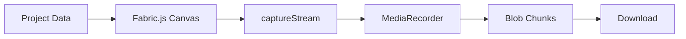

# Video Export Pipeline

> **Prerequisites**: Read [09-editor-architecture.md](./09-editor-architecture.md) first.
>
> **Key Files**:
> - [`src/lib/core/VideoExporter.ts`](file:///c:/Users/kiran/code/p/videographic/videographic%20nextjs/src/lib/core/VideoExporter.ts) - Export engine
> - [`src/components/editor/ExportModal.tsx`](file:///c:/Users/kiran/code/p/videographic/videographic%20nextjs/src/components/editor/ExportModal.tsx) - Export UI

---

## 🎯 What You'll Learn

- How video export works
- MediaRecorder and codec selection
- Frame-by-frame rendering pipeline
- Quality presets and bitrate control
- Trim functionality
- Progress tracking

---

## 📹 Export Overview

Videographic exports videos using the **Canvas Stream Recording** approach:



---

## 🎬 VideoExporter Class

The core export engine:

```typescript
// src/lib/core/VideoExporter.ts

export class VideoExporter {
  static isSupported(): boolean {
    return typeof MediaRecorder !== "undefined" && 
           typeof HTMLCanvasElement !== "undefined";
  }

  async export(options: ExportOptions): Promise<Blob> {
    // 1. Create off-screen canvas
    // 2. Setup MediaRecorder
    // 3. Render each frame
    // 4. Return video blob
  }

  async exportAndDownload(options: ExportOptions): Promise<void> {
    const blob = await this.export(options);
    // Trigger browser download
  }
}
```

---

## 📊 Export Options

```typescript
interface ExportOptions {
  project: VideoProject;
  config?: {
    bitrate?: number;  // Video bitrate in bps
  };
  filename?: string;
  onProgress?: (progress: ExportProgress) => void;
}

interface ExportProgress {
  phase: "preparing" | "rendering" | "encoding" | "muxing" | "complete" | "error";
  currentFrame: number;
  totalFrames: number;
  percentage: number;
  message: string;
}
```

---

## 🎞️ Codec Selection

The exporter tries multiple codecs in order of preference:

```typescript
const mimeTypes = [
  "video/webm;codecs=vp9",        // Best quality
  "video/mp4;codecs=avc1.640028", // H.264 High Profile
  "video/mp4;codecs=avc1.42E01E", // H.264 Baseline
  "video/webm;codecs=vp8",        // Fallback
  "video/webm",                    // Basic WebM
  "video/mp4",                     // Basic MP4
];

let selectedMimeType = "";
for (const mimeType of mimeTypes) {
  if (MediaRecorder.isTypeSupported(mimeType)) {
    selectedMimeType = mimeType;
    break;
  }
}
```

---

## 🔄 Render Loop

The export renders each frame at the project's FPS:

```typescript
async export(options: ExportOptions): Promise<Blob> {
  const { project, onProgress } = options;
  
  // Create off-screen Fabric.js canvas
  const canvas = document.createElement("canvas");
  canvas.width = project.width;
  canvas.height = project.height;

  const fabricCanvas = new fabric.StaticCanvas(canvas, {
    width: project.width,
    height: project.height,
    backgroundColor: project.backgroundColor,
  });

  // Setup MediaRecorder
  const stream = canvas.captureStream(project.fps);
  const recorder = new MediaRecorder(stream, {
    mimeType: selectedMimeType,
    videoBitsPerSecond: bitrate,
  });

  const chunks: Blob[] = [];
  recorder.ondataavailable = (e) => {
    if (e.data.size > 0) chunks.push(e.data);
  };

  recorder.start();

  // Render each frame
  const totalFrames = Math.ceil(project.duration * project.fps);
  const frameDuration = 1000 / project.fps;

  for (let frame = 0; frame < totalFrames; frame++) {
    const currentTime = frame / project.fps;

    // Clear and render
    fabricCanvas.clear();
    fabricCanvas.backgroundColor = project.backgroundColor;

    for (const event of project.events) {
      if (isVisible(event, currentTime)) {
        const props = computeProperties(event, currentTime);
        renderEvent(fabricCanvas, event, props);
      }
    }

    fabricCanvas.renderAll();

    // Update progress
    onProgress({
      phase: "encoding",
      currentFrame: frame + 1,
      totalFrames,
      percentage: Math.round((frame / totalFrames) * 100),
      message: `Encoding frame ${frame + 1}/${totalFrames}`,
    });

    // Wait for frame duration
    await new Promise(r => setTimeout(r, frameDuration));
  }

  recorder.stop();
  await new Promise(resolve => { recorder.onstop = resolve; });

  return new Blob(chunks, { type: mimeType });
}
```

---

## 📐 Quality Presets

The ExportModal offers three quality levels:

```typescript
const QUALITY_PRESETS = {
  standard: {
    label: "Standard",
    bitrate: 5_000_000,  // 5 Mbps
    description: "Good balance of quality and file size"
  },
  high: {
    label: "High",
    bitrate: 10_000_000, // 10 Mbps
    description: "Higher quality, larger file size"
  },
  ultra: {
    label: "Ultra",
    bitrate: 20_000_000, // 20 Mbps
    description: "Maximum quality, largest file size"
  }
};
```

### Estimated File Size

```typescript
// Rough approximation based on bitrate
const estimatedSizeMB = (
  QUALITY_PRESETS[quality].bitrate * duration / 8 / 1_000_000
).toFixed(1);

// Example: 10 second video at High quality
// 10_000_000 * 10 / 8 / 1_000_000 = 12.5 MB
```

---

## ✂️ Trim Functionality

Users can trim the start and end of the video:

```typescript
// In ExportModal
const [trimStart, setTrimStart] = useState(0);
const [trimEnd, setTrimEnd] = useState(0);

const effectiveDuration = projectDuration - trimStart - trimEnd;

// Create trimmed project for export
const trimmedProject = {
  ...project,
  duration: effectiveDuration,
  events: project.events
    .map(event => ({
      ...event,
      startTime: event.startTime - trimStart,
    }))
    .filter(event => {
      // Keep events that overlap with trimmed duration
      const eventEnd = event.startTime + event.duration;
      return eventEnd > 0 && event.startTime < effectiveDuration;
    })
    .map(event => ({
      ...event,
      startTime: Math.max(0, event.startTime),
      duration: Math.min(event.duration, effectiveDuration - event.startTime),
    })),
};
```

---

## 📥 Download

After export, the blob is downloaded:

```typescript
async exportAndDownload(options: ExportOptions): Promise<void> {
  const blob = await this.export(options);
  
  const extension = blob.type.includes("mp4") ? "mp4" : "webm";
  const filename = `${options.project.name.replace(/\s+/g, "-")}.${extension}`;

  const url = URL.createObjectURL(blob);
  const a = document.createElement("a");
  a.href = url;
  a.download = filename;
  document.body.appendChild(a);
  a.click();
  document.body.removeChild(a);
  
  setTimeout(() => URL.revokeObjectURL(url), 1000);
}
```

---

## 🎭 Property Computation

During export, animated properties are recalculated per frame:

```typescript
function computeProperties(event: TimelineEvent, currentTime: number) {
  const properties = { ...event.properties };

  // Apply animations
  if (event.animations?.length) {
    const localTime = currentTime - event.startTime;
    for (const animation of event.animations) {
      const value = interpolateAnimation(animation, localTime, event.duration);
      if (value !== null) {
        properties[animation.property] = value;
      }
    }
  }

  // Apply smooth exit effect (fade out during last 0.3 seconds)
  const exitDuration = 0.3;
  const timeUntilEnd = event.duration - (currentTime - event.startTime);
  
  if (timeUntilEnd <= exitDuration && timeUntilEnd > 0) {
    const exitProgress = 1 - (timeUntilEnd / exitDuration);
    properties.opacity *= (1 - exitProgress);
    properties.scale *= (1 - exitProgress * 0.1);
  }

  return properties;
}
```

---

## 📋 Export Progress UI

The ExportModal shows detailed progress:

```typescript
{isExporting && (
  <div>
    {/* Progress bar */}
    <div className="h-3 bg-slate-800 rounded-full overflow-hidden">
      <div
        className="bg-linear-to-r from-purple-500 to-pink-500"
        style={{ width: `${progress?.percentage || 0}%` }}
      />
    </div>

    {/* Phase message */}
    <p>{getProgressMessage()}</p>

    {/* Frame counter */}
    <p>Frame {progress.currentFrame} of {progress.totalFrames}</p>
  </div>
)}

const getProgressMessage = () => {
  switch (progress.phase) {
    case "preparing": return "🔧 Initializing encoder...";
    case "encoding": return `🎬 Encoding: ${progress.percentage}%`;
    case "complete": return "✅ Export complete!";
    case "error": return `❌ Error: ${progress.message}`;
  }
};
```

---

## ⚠️ Browser Compatibility

```typescript
// Check support in ExportModal
const isFirefox = navigator.userAgent.toLowerCase().includes("firefox");

{isFirefox && (
  <div className="text-amber-400">
    ⚠️ For best export quality, we recommend using Chrome or Edge.
  </div>
)}
```

---

## 🔧 Rendering All Element Types

The exporter handles all element types:

```typescript
for (const event of project.events) {
  if (!isVisible(event, currentTime)) continue;

  const props = computeProperties(event, currentTime);

  if (event.type === "text") {
    const text = new fabric.Textbox(props.text, {
      left: props.x,
      top: props.y,
      fontSize: props.fontSize,
      fontFamily: props.fontFamily,
      fill: props.fill,
      opacity: props.opacity,
      // ...
    });
    fabricCanvas.add(text);
  }
  else if (event.type === "shape") {
    switch (props.shapeType) {
      case "rect":
        fabricCanvas.add(new fabric.Rect({ ... }));
        break;
      case "circle":
        fabricCanvas.add(new fabric.Circle({ ... }));
        break;
      case "ellipse":
        fabricCanvas.add(new fabric.Ellipse({ ... }));
        break;
      case "triangle":
        fabricCanvas.add(new fabric.Triangle({ ... }));
        break;
      case "line":
        fabricCanvas.add(new fabric.Line([x1, y1, x2, y2], { ... }));
        break;
      case "arrow":
        // Rendered as rounded rectangle
        fabricCanvas.add(new fabric.Rect({ ... }));
        break;
    }
  }
}
```

---

## 🔧 Build Steps

Files to create:

| Step | File | Action |
|------|------|--------|
| 1 | `src/lib/core/VideoExporter.ts` | Export engine class |
| 2 | `src/components/editor/ExportModal.tsx` | Export UI modal |

### Step 1: Create VideoExporter

Create `src/lib/core/VideoExporter.ts` with:
- `isSupported()` static method
- `export()` method using MediaRecorder
- `exportAndDownload()` method for browser download
- Codec selection logic
- Frame-by-frame render loop

### Step 2: Create ExportModal

Create `src/components/editor/ExportModal.tsx` with:
- Quality presets (Standard, High, Ultra)
- Trim controls
- Progress visualization
- Export/download buttons

---

## 📚 Next Steps

Learn how AI generates video content:

→ **[11-ai-generation.md](./11-ai-generation.md)** - AI Generation System

---

*The export pipeline transforms your timeline into a real video file - understanding this helps you debug export issues.*
