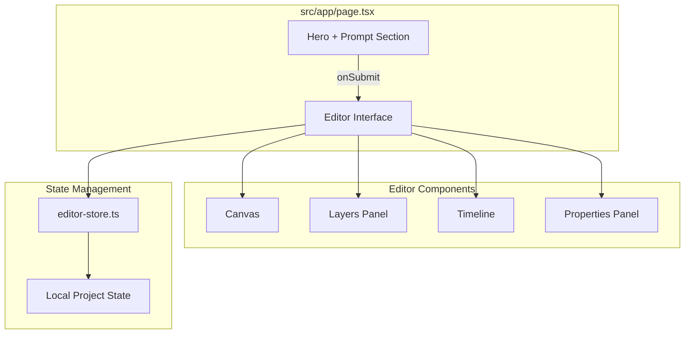

# Single Page Editor Plan

## Overview
Build a simplified React app with a single page that combines a landing hero section with a prompt input. On prompt submission, the hero section is hidden and replaced with the full video editor interface (canvas, layers, timeline, and properties).

No backend required - all components will work with local state.

## Architecture



## Implementation Steps

### 1. Create New Page Structure
**File:** `src/app/page.tsx`
- Create a client component that manages view state (hero vs editor)
- State: `hasSubmitted` boolean to toggle between views
- Initial view: Hero section + Prompt input at bottom
- After submit: Full editor interface

### 2. Create PromptInput Component
**File:** `src/components/landing/PromptInput.tsx`
- Large text input area for video description
- Aspect ratio selector (16:9, 9:16, 1:1, 4:3)
- Duration selector (5s, 10s, 15s, 30s)
- Generate button
- Styled to match existing hero design

### 3. Create Simplified Editor Client
**File:** `src/components/editor/SimpleEditorClient.tsx`
- Based on existing `EditorClient.tsx` but:
  - Remove auth-related code
  - Remove save/load API calls
  - Remove export functionality (optional)
  - Initialize with empty project on mount
- Layout: 3-column design
  - Left: Layers panel
  - Center: Canvas + Timeline
  - Right: Properties panel

### 4. Create Mock Project Generator
**File:** `src/lib/mock-generator.ts`
- Generate sample timeline events based on prompt
- Create placeholder text/shape elements
- Return `VideoProject` object compatible with editor store
- No AI - just deterministic mock data

### 5. Update Hero Component
**File:** `src/components/landing/hero.tsx`
- Remove `isLoggedIn` prop dependency
- Remove CTA buttons (Start Creating, Watch Demo)
- Keep visual design (gradient background, animations)
- Make it accept children for the prompt input section

### 6. Update Editor Store
**File:** `src/stores/editor-store.ts`
- Ensure all actions work without backend
- Remove `executeAICommands` or make it optional
- Keep local history (undo/redo) functionality

## File Structure

```
src/
├── app/
│   └── page.tsx                    # Single page with hero + editor toggle
├── components/
│   ├── landing/
│   │   ├── hero.tsx                # Updated hero (no auth deps)
│   │   └── PromptInput.tsx         # New: Prompt input component
│   └── editor/
│       ├── SimpleEditorClient.tsx  # New: Simplified editor
│       ├── Canvas.tsx              # Existing (no changes)
│       ├── Timeline.tsx            # Existing (no changes)
│       ├── PropertyPanel.tsx       # Existing (no changes)
│       └── ...other existing components
├── lib/
│   ├── mock-generator.ts           # New: Mock project generator
│   └── schemas/
│       └── timeline.ts             # Existing (no changes)
└── stores/
    └── editor-store.ts             # Minor updates for no-backend mode
```

## Component Details

### PromptInput Component
**File:** `src/components/landing/PromptInput.tsx`

```typescript
"use client";

import { useState } from "react";
import { motion } from "framer-motion";

type AspectRatio = "16:9" | "9:16" | "1:1" | "4:3";

interface PromptInputProps {
  onSubmit: (data: {
    prompt: string;
    aspectRatio: AspectRatio;
    duration: number;
  }) => void;
}

const ASPECT_RATIOS: { value: AspectRatio; label: string; dims: { w: number; h: number } }[] = [
  { value: "16:9", label: "16:9 Landscape", dims: { w: 1920, h: 1080 } },
  { value: "9:16", label: "9:16 Portrait", dims: { w: 1080, h: 1920 } },
  { value: "1:1", label: "1:1 Square", dims: { w: 1080, h: 1080 } },
  { value: "4:3", label: "4:3 Standard", dims: { w: 1440, h: 1080 } },
];

const DURATION_OPTIONS = [
  { value: 5, label: "5s" },
  { value: 10, label: "10s" },
  { value: 15, label: "15s" },
  { value: 30, label: "30s" },
];

export function PromptInput({ onSubmit }: PromptInputProps) {
  const [prompt, setPrompt] = useState("");
  const [aspectRatio, setAspectRatio] = useState<AspectRatio>("16:9");
  const [duration, setDuration] = useState(10);
  const [isSubmitting, setIsSubmitting] = useState(false);

  const handleSubmit = async (e: React.FormEvent) => {
    e.preventDefault();
    if (!prompt.trim() || isSubmitting) return;
    
    setIsSubmitting(true);
    
    // Small delay for visual feedback
    await new Promise(resolve => setTimeout(resolve, 300));
    
    onSubmit({
      prompt: prompt.trim(),
      aspectRatio,
      duration,
    });
    
    setIsSubmitting(false);
  };

  return (
    <motion.div
      initial={{ opacity: 0, y: 30 }}
      animate={{ opacity: 1, y: 0 }}
      transition={{ duration: 0.6, delay: 0.5 }}
      className="w-full max-w-3xl mx-auto mt-12"
    >
      <form onSubmit={handleSubmit} className="space-y-6">
        {/* Prompt Textarea */}
        <div className="relative">
          <textarea
            value={prompt}
            onChange={(e) => setPrompt(e.target.value)}
            placeholder="Describe the video you want to create..."
            className="w-full h-32 bg-slate-900/50 backdrop-blur-sm border border-white/10 rounded-2xl px-6 py-4 text-white placeholder:text-gray-500 focus:border-purple-500 focus:outline-none focus:ring-2 focus:ring-purple-500/20 resize-none text-lg"
          />
          <div className="absolute bottom-3 right-4 text-xs text-gray-500">
            {prompt.length} chars
          </div>
        </div>

        {/* Controls Row */}
        <div className="flex flex-wrap items-center justify-center gap-4">
          {/* Aspect Ratio Selector */}
          <div className="flex items-center gap-2 bg-slate-900/50 backdrop-blur-sm border border-white/10 rounded-xl p-1">
            {ASPECT_RATIOS.map((ar) => (
              <button
                key={ar.value}
                type="button"
                onClick={() => setAspectRatio(ar.value)}
                className={`px-3 py-1.5 rounded-lg text-sm font-medium transition-all ${
                  aspectRatio === ar.value
                    ? "bg-purple-600 text-white"
                    : "text-gray-400 hover:text-white hover:bg-white/5"
                }`}
              >
                {ar.label}
              </button>
            ))}
          </div>

          {/* Duration Selector */}
          <div className="flex items-center gap-2 bg-slate-900/50 backdrop-blur-sm border border-white/10 rounded-xl p-1">
            {DURATION_OPTIONS.map((opt) => (
              <button
                key={opt.value}
                type="button"
                onClick={() => setDuration(opt.value)}
                className={`px-3 py-1.5 rounded-lg text-sm font-medium transition-all ${
                  duration === opt.value
                    ? "bg-purple-600 text-white"
                    : "text-gray-400 hover:text-white hover:bg-white/5"
                }`}
              >
                {opt.label}
              </button>
            ))}
          </div>
        </div>

        {/* Submit Button */}
        <motion.button
          type="submit"
          disabled={!prompt.trim() || isSubmitting}
          whileHover={{ scale: 1.02 }}
          whileTap={{ scale: 0.98 }}
          className="w-full py-4 bg-linear-to-r from-purple-600 to-pink-600 text-white font-semibold rounded-2xl hover:from-purple-500 hover:to-pink-500 transition-all disabled:opacity-50 disabled:cursor-not-allowed shadow-lg shadow-purple-500/25 text-lg"
        >
          {isSubmitting ? (
            <span className="flex items-center justify-center gap-2">
              <motion.span
                animate={{ rotate: 360 }}
                transition={{ repeat: Infinity, duration: 1, ease: "linear" }}
                className="inline-block w-5 h-5 border-2 border-white/30 border-t-white rounded-full"
              />
              Creating...
            </span>
          ) : (
            <span className="flex items-center justify-center gap-2">
              ✨ Generate Video
              <span>→</span>
            </span>
          )}
        </motion.button>
      </form>
    </motion.div>
  );
}
```

### Updated Hero Component
**File:** `src/components/landing/hero.tsx`

```typescript
"use client";

import { motion } from "framer-motion";
import { ReactNode } from "react";

interface HeroProps {
  children?: ReactNode;
}

export function Hero({ children }: HeroProps) {
  return (
    <section className="relative min-h-screen flex flex-col items-center justify-center overflow-hidden">
      {/* Animated background */}
      <div className="absolute inset-0 animated-gradient opacity-50" />

      {/* Gradient orbs */}
      <div className="absolute top-1/4 left-1/4 w-96 h-96 bg-purple-600/30 rounded-full blur-3xl" />
      <div className="absolute bottom-1/4 right-1/4 w-96 h-96 bg-pink-600/30 rounded-full blur-3xl" />

      {/* Content */}
      <div className="relative z-10 max-w-5xl mx-auto px-6 text-center">
        <motion.div
          initial={{ opacity: 0, y: 20 }}
          animate={{ opacity: 1, y: 0 }}
          transition={{ duration: 0.5 }}
        >
          <span className="inline-flex items-center gap-2 px-4 py-2 rounded-full bg-white/10 border border-white/20 text-sm text-gray-300 mb-8">
            <span className="w-2 h-2 bg-green-400 rounded-full animate-pulse" />
            Now with AI-powered generation
          </span>
        </motion.div>

        <motion.h1
          initial={{ opacity: 0, y: 20 }}
          animate={{ opacity: 1, y: 0 }}
          transition={{ duration: 0.5, delay: 0.1 }}
          className="text-5xl md:text-7xl font-bold text-white leading-tight mb-6"
        >
          Create Stunning Videos
          <br />
          <span className="gradient-text">From Text</span>
        </motion.h1>

        <motion.p
          initial={{ opacity: 0, y: 20 }}
          animate={{ opacity: 1, y: 0 }}
          transition={{ duration: 0.5, delay: 0.2 }}
          className="text-xl text-gray-300 max-w-2xl mx-auto mb-10"
        >
          Transform your ideas into professional videos in seconds.
          Just describe what you want, and our AI handles the rest.
        </motion.p>

        {/* Prompt Input Section */}
        {children}

        {/* Stats */}
        <motion.div
          initial={{ opacity: 0, y: 20 }}
          animate={{ opacity: 1, y: 0 }}
          transition={{ duration: 0.5, delay: 0.6 }}
          className="flex items-center justify-center gap-12 mt-16 pt-16 border-t border-white/10"
        >
          <div className="text-center">
            <div className="text-3xl font-bold text-white">10K+</div>
            <div className="text-gray-400">Videos Created</div>
          </div>
          <div className="text-center">
            <div className="text-3xl font-bold text-white">5K+</div>
            <div className="text-gray-400">Happy Users</div>
          </div>
          <div className="text-center">
            <div className="text-3xl font-bold text-white">4.9/5</div>
            <div className="text-gray-400">User Rating</div>
          </div>
        </motion.div>
      </div>

      {/* Scroll indicator */}
      <motion.div
        initial={{ opacity: 0 }}
        animate={{ opacity: 1 }}
        transition={{ delay: 1 }}
        className="absolute bottom-8 left-1/2 -translate-x-1/2"
      >
        <div className="w-6 h-10 rounded-full border-2 border-white/20 flex justify-center pt-2">
          <motion.div
            animate={{ y: [0, 8, 0] }}
            transition={{ repeat: Infinity, duration: 1.5 }}
            className="w-1.5 h-1.5 bg-white rounded-full"
          />
        </div>
      </motion.div>
    </section>
  );
}
```

### SimpleEditorClient Component
**File:** `src/components/editor/SimpleEditorClient.tsx`

```typescript
"use client";

import { useEffect, useState, useCallback, useRef } from "react";
import { useEditorStore } from "@/stores/editor-store";
import { Canvas } from "@/components/editor/Canvas";
import { Timeline } from "@/components/editor/Timeline";
import { PropertyPanel } from "@/components/editor/PropertyPanel";
import { AddElementToolbar } from "@/components/editor/AddElementToolbar";
import { ContextMenu } from "@/components/editor/ContextMenu";
import { useResizable } from "@/components/editor/hooks/useResizable";
import type { VideoProject as EditorVideoProject } from "@/lib/schemas/timeline";

interface SimpleEditorClientProps {
  initialProject: EditorVideoProject;
}

// Floating Play Button Component for when Timeline is hidden
function FloatingPlayButton() {
    const { currentTime, setCurrentTime, isPlaying, setIsPlaying, project } = useEditorStore();
    const totalDuration = project?.duration || 10;

    useEffect(() => {
        let animationFrame: number;
        let lastTime = performance.now();

        const loop = (timestamp: number) => {
            if (!useEditorStore.getState().isPlaying) return;

            const dt = (timestamp - lastTime) / 1000;
            lastTime = timestamp;

            const state = useEditorStore.getState();
            let newTime = state.currentTime + dt;

            if (newTime >= totalDuration) {
                newTime = 0;
                setIsPlaying(false);
            }

            setCurrentTime(newTime);
            animationFrame = requestAnimationFrame(loop);
        };

        if (isPlaying) {
            lastTime = performance.now();
            animationFrame = requestAnimationFrame(loop);
        }

        return () => {
            if (animationFrame) cancelAnimationFrame(animationFrame);
        };
    }, [isPlaying, totalDuration, setCurrentTime, setIsPlaying]);

    const formatTime = (seconds: number) => {
        const mins = Math.floor(seconds / 60);
        const secs = Math.floor(seconds % 60);
        return `${mins}:${secs.toString().padStart(2, "0")}`;
    };

    return (
        <div className="absolute bottom-4 left-1/2 -translate-x-1/2 z-30 flex items-center gap-3 px-4 py-2.5 bg-slate-900/95 backdrop-blur-sm rounded-xl border border-white/10 shadow-xl">
            <button
                onClick={() => setCurrentTime(0)}
                className="p-1.5 hover:bg-white/10 rounded-lg text-gray-400 hover:text-white transition-colors"
                title="Reset"
            >
                ⏮
            </button>
            <button
                onClick={() => setIsPlaying(!isPlaying)}
                className="w-10 h-10 flex items-center justify-center bg-purple-600 hover:bg-purple-500 text-white rounded-full transition-colors shadow-lg shadow-purple-500/30"
                title={isPlaying ? "Pause" : "Play"}
            >
                <span className="text-lg">{isPlaying ? "⏸" : "▶"}</span>
            </button>
            <div className="flex items-center gap-1.5 text-sm font-mono">
                <span className="text-purple-400">{formatTime(currentTime)}</span>
                <span className="text-gray-600">/</span>
                <span className="text-gray-400">{formatTime(totalDuration)}</span>
            </div>
            <div className="w-24 h-1.5 bg-slate-700 rounded-full overflow-hidden">
                <div
                    className="h-full bg-purple-500 transition-all duration-100"
                    style={{ width: `${(currentTime / totalDuration) * 100}%` }}
                />
            </div>
        </div>
    );
}

export function SimpleEditorClient({ initialProject }: SimpleEditorClientProps) {
    const { project, setProject, selectedIds, toggleSelectedId, clearSelection, canvas, undo, redo, canUndo, canRedo, reorderLayers, deleteSelectedEvents, duplicateSelectedEvents } =
        useEditorStore();
    
    // Drag and drop state for layers
    const [dragOverIndex, setDragOverIndex] = useState<number | null>(null);
    const [draggingIndex, setDraggingIndex] = useState<number | null>(null);
    const [dropPosition, setDropPosition] = useState<"above" | "below" | null>(null);

    // Context menu state
    const [contextMenu, setContextMenu] = useState<{ x: number; y: number; eventId: string | null } | null>(null);

    // Panel visibility states
    const [showLayers, setShowLayers] = useState(true);
    const [showProperties, setShowProperties] = useState(true);
    const [showTimeline, setShowTimeline] = useState(true);
    const [isPreviewMode, setIsPreviewMode] = useState(false);

    // Store previous panel states for preview mode toggle
    const prevPanelStatesRef = useRef({ layers: true, properties: true, timeline: true });

    // Toggle preview mode
    const togglePreviewMode = useCallback(() => {
        if (isPreviewMode) {
            setShowLayers(prevPanelStatesRef.current.layers);
            setShowProperties(prevPanelStatesRef.current.properties);
            setShowTimeline(prevPanelStatesRef.current.timeline);
            setIsPreviewMode(false);
        } else {
            prevPanelStatesRef.current = { layers: showLayers, properties: showProperties, timeline: showTimeline };
            setShowLayers(false);
            setShowProperties(false);
            setShowTimeline(false);
            setIsPreviewMode(true);
        }
    }, [isPreviewMode, showLayers, showProperties, showTimeline]);

    // Resizable timeline
    const { height: timelineHeight, handleMouseDown: handleTimelineDrag } = useResizable(200, 100, 600);

    // Check if project is empty
    const isProjectEmpty = project?.events.length === 0;

    // Load project into store on mount
    useEffect(() => {
        setProject(initialProject);
    }, [initialProject, setProject]);

    // Keyboard shortcuts
    useEffect(() => {
        const handleKeyDown = (e: KeyboardEvent) => {
            if ((e.ctrlKey || e.metaKey) && e.key === "z" && !e.shiftKey) {
                e.preventDefault();
                undo();
            }
            if (((e.ctrlKey || e.metaKey) && e.shiftKey && e.key === "z") ||
                ((e.ctrlKey || e.metaKey) && e.key === "y")) {
                e.preventDefault();
                redo();
            }
            if ((e.ctrlKey || e.metaKey) && e.key === "d") {
                e.preventDefault();
                if (selectedIds.size > 0) {
                    duplicateSelectedEvents();
                }
            }
            if ((e.key === "Delete" || e.key === "Backspace") && selectedIds.size > 0) {
                const target = e.target as HTMLElement;
                if (target.tagName !== "INPUT" && target.tagName !== "TEXTAREA") {
                    e.preventDefault();
                    deleteSelectedEvents();
                }
            }
            if (e.key === "Escape") {
                clearSelection();
            }
        };

        window.addEventListener("keydown", handleKeyDown);
        return () => window.removeEventListener("keydown", handleKeyDown);
    }, [selectedIds, clearSelection, undo, redo, deleteSelectedEvents, duplicateSelectedEvents]);

    // Save history on property changes
    useEffect(() => {
        const timeout = setTimeout(() => {
            const { project, isUndoRedoing } = useEditorStore.getState();
            if (project && !isUndoRedoing) {
                // Trigger saveToHistory through the store
            }
        }, 500);
        return () => clearTimeout(timeout);
    }, [project?.events]);

    if (!project) {
        return (
            <div className="min-h-screen flex items-center justify-center bg-slate-950 text-white">
                <div className="text-center">
                    <div className="animate-spin w-8 h-8 border-2 border-purple-500 border-t-transparent rounded-full mx-auto mb-4" />
                    <p className="text-gray-400">Loading project...</p>
                </div>
            </div>
        );
    }

    return (
        <div className="h-screen flex flex-col bg-slate-950 overflow-hidden">
            {/* Header */}
            <header className="h-14 border-b border-white/10 bg-slate-900/50 flex items-center justify-between px-4 shrink-0">
                <div className="flex items-center gap-4">
                    <div>
                        <h1 className="text-sm font-semibold text-white">{project.name}</h1>
                        <p className="text-xs text-gray-500">
                            {project.width}x{project.height} • {project.fps}fps • {project.duration}s
                        </p>
                    </div>
                </div>

                <div className="flex items-center gap-2">
                    {/* Panel toggles */}
                    <div className="flex items-center gap-1 mr-2 border-r border-white/10 pr-3">
                        <button
                            onClick={() => setShowLayers(!showLayers)}
                            className={`px-2.5 py-1.5 rounded-lg text-xs font-medium transition-all flex items-center gap-1.5 ${showLayers
                                ? 'bg-purple-600/30 text-purple-300 border border-purple-500/40'
                                : 'bg-slate-800/80 text-gray-400 hover:text-white hover:bg-slate-700/80 border border-white/10'}`}
                            title="Toggle Layers Panel"
                        >
                            <span>📑</span>
                            <span className="hidden sm:inline">Layers</span>
                        </button>
                        <button
                            onClick={() => setShowTimeline(!showTimeline)}
                            className={`px-2.5 py-1.5 rounded-lg text-xs font-medium transition-all flex items-center gap-1.5 ${showTimeline
                                ? 'bg-purple-600/30 text-purple-300 border border-purple-500/40'
                                : 'bg-slate-800/80 text-gray-400 hover:text-white hover:bg-slate-700/80 border border-white/10'}`}
                            title="Toggle Timeline Panel"
                        >
                            <span>🎬</span>
                            <span className="hidden sm:inline">Timeline</span>
                        </button>
                        <button
                            onClick={() => setShowProperties(!showProperties)}
                            className={`px-2.5 py-1.5 rounded-lg text-xs font-medium transition-all flex items-center gap-1.5 ${showProperties
                                ? 'bg-purple-600/30 text-purple-300 border border-purple-500/40'
                                : 'bg-slate-800/80 text-gray-400 hover:text-white hover:bg-slate-700/80 border border-white/10'}`}
                            title="Toggle Properties Panel"
                        >
                            <span>⚙️</span>
                            <span className="hidden sm:inline">Properties</span>
                        </button>
                    </div>

                    {/* Undo/Redo buttons */}
                    <div className="flex items-center gap-1 mr-2 border-r border-white/10 pr-3">
                        <button
                            onClick={undo}
                            disabled={!canUndo()}
                            className="p-1.5 rounded-lg text-sm transition-all disabled:opacity-30 disabled:cursor-not-allowed bg-slate-800/80 text-gray-400 hover:text-white hover:bg-slate-700/80 border border-white/10"
                            title="Undo (Ctrl+Z)"
                        >
                            undo
                        </button>
                        <button
                            onClick={redo}
                            disabled={!canRedo()}
                            className="p-1.5 rounded-lg text-sm transition-all disabled:opacity-30 disabled:cursor-not-allowed bg-slate-800/80 text-gray-400 hover:text-white hover:bg-slate-700/80 border border-white/10"
                            title="Redo (Ctrl+Shift+Z)"
                        >
                            redo
                        </button>
                    </div>
                </div>
            </header>

            {/* Workspace */}
            <div className="flex-1 flex overflow-hidden">
                {/* Left Sidebar - Layers */}
                {showLayers && (
                    <div className="w-60 border-r border-white/10 bg-slate-900/30 flex flex-col shrink-0">
                        <div className="p-3 border-b border-white/10 flex items-center justify-between">
                            <div className="flex items-center gap-2">
                                <h3 className="text-xs font-semibold text-gray-400 uppercase tracking-wider">
                                    Layers
                                </h3>
                                {selectedIds.size > 1 && (
                                    <span className="text-[10px] px-1.5 py-0.5 bg-purple-600/30 text-purple-300 rounded">
                                        {selectedIds.size} selected
                                    </span>
                                )}
                            </div>
                            <div className="flex items-center gap-2">
                                <span className="text-xs text-gray-500" title="Total layers">{project.events.length}</span>
                                <button
                                    onClick={() => setShowLayers(false)}
                                    className="p-1 hover:bg-white/10 rounded text-gray-500 hover:text-white transition-colors"
                                    title="Hide Layers"
                                >
                                    ✕
                                </button>
                            </div>
                        </div>
                        <div className="flex-1 overflow-y-auto p-2 space-y-1">
                            {project.events.length === 0 ? (
                                <div className="text-center py-8 px-4">
                                    <div className="text-3xl mb-2">🎨</div>
                                    <p className="text-gray-500 text-xs">
                                        No elements yet. Add some elements!
                                    </p>
                                </div>
                            ) : (
                                [...project.events].reverse().map((event, idx) => {
                                    const actualIdx = project.events.length - 1 - idx;
                                    const getIcon = () => {
                                        switch (event.type) {
                                            case "text": return "📝";
                                            case "shape": return "🟦";
                                            case "image": return "🖼️";
                                            case "audio": return "🔊";
                                            case "background": return "🎨";
                                            default: return "📦";
                                        }
                                    };
                                    const getLabel = () => {
                                        if (event.type === "text" && "text" in event.properties) {
                                            const text = (event.properties as { text?: string }).text;
                                            return text?.substring(0, 15) || "Text";
                                        }
                                        const sameTypeEvents = project.events
                                            .filter(e => e.type === event.type)
                                            .sort((a, b) => a.id.localeCompare(b.id));
                                        const orderIndex = sameTypeEvents.findIndex(e => e.id === event.id) + 1;
                                        return `${event.type} ${orderIndex}`;
                                    };
                                    const isDragging = draggingIndex === actualIdx;
                                    const isDragOver = dragOverIndex === actualIdx;
                                    return (
                                        <div
                                            key={event.id}
                                            draggable
                                            onDragStart={(e) => {
                                                e.dataTransfer.setData("text/plain", String(actualIdx));
                                                e.dataTransfer.effectAllowed = "move";
                                                setDraggingIndex(actualIdx);
                                                setTimeout(() => {
                                                    const target = e.target as HTMLElement;
                                                    target.style.opacity = "0.4";
                                                }, 0);
                                            }}
                                            onDragEnd={(e) => {
                                                const target = e.target as HTMLElement;
                                                target.style.opacity = "1";
                                                setDraggingIndex(null);
                                                setDragOverIndex(null);
                                                setDropPosition(null);
                                            }}
                                            onDragOver={(e) => {
                                                e.preventDefault();
                                                e.dataTransfer.dropEffect = "move";
                                                if (draggingIndex !== actualIdx) {
                                                    const rect = e.currentTarget.getBoundingClientRect();
                                                    const midpoint = rect.top + rect.height / 2;
                                                    const isAbove = e.clientY < midpoint;
                                                    setDragOverIndex(actualIdx);
                                                    setDropPosition(isAbove ? "above" : "below");
                                                }
                                            }}
                                            onDrop={(e) => {
                                                e.preventDefault();
                                                const fromIdx = parseInt(e.dataTransfer.getData("text/plain"));
                                                if (!isNaN(fromIdx) && fromIdx !== actualIdx) {
                                                    let targetIdx = actualIdx;
                                                    if (fromIdx < actualIdx) {
                                                        targetIdx = dropPosition === "above" ? actualIdx : actualIdx - 1;
                                                    } else {
                                                        targetIdx = dropPosition === "above" ? actualIdx + 1 : actualIdx;
                                                    }
                                                    reorderLayers(fromIdx, targetIdx);
                                                }
                                                setDragOverIndex(null);
                                                setDraggingIndex(null);
                                                setDropPosition(null);
                                            }}
                                            onClick={(e) => toggleSelectedId(event.id, e.ctrlKey || e.metaKey)}
                                            onContextMenu={(e) => {
                                                e.preventDefault();
                                                e.stopPropagation();
                                                setContextMenu({ x: e.clientX, y: e.clientY, eventId: event.id });
                                            }}
                                            className={`group p-2 rounded-lg cursor-grab text-sm flex items-center gap-2 transition-all relative ${selectedIds.has(event.id)
                                                ? "bg-purple-600/30 border border-purple-500/50 text-white"
                                                : "bg-slate-800/50 border border-transparent hover:border-white/10 text-gray-300"
                                                } ${isDragging ? "opacity-40" : ""}`}
                                        >
                                            {isDragOver && dropPosition === "above" && (
                                                <div className="absolute -top-1 left-0 right-0 h-1 bg-white rounded-full shadow-[0_0_8px_rgba(255,255,255,0.8)] z-50 pointer-events-none" />
                                            )}
                                            {isDragOver && dropPosition === "below" && (
                                                <div className="absolute -bottom-1 left-0 right-0 h-1 bg-white rounded-full shadow-[0_0_8px_rgba(255,255,255,0.8)] z-50 pointer-events-none" />
                                            )}
                                            <span className="shrink-0 cursor-grab" title="Drag to reorder">⋮⋮</span>
                                            <span className="shrink-0">{getIcon()}</span>
                                            <span className="truncate flex-1 capitalize">{getLabel()}</span>
                                            <div className="opacity-0 group-hover:opacity-100 flex gap-0.5 transition-opacity">
                                                <button
                                                    onClick={(e) => {
                                                        e.stopPropagation();
                                                        if (actualIdx < project.events.length - 1) {
                                                            reorderLayers(actualIdx, actualIdx + 1);
                                                        }
                                                    }}
                                                    className="p-1 hover:bg-white/10 rounded text-xs"
                                                    title="Move up"
                                                >
                                                    ↑
                                                </button>
                                                <button
                                                    onClick={(e) => {
                                                        e.stopPropagation();
                                                        if (actualIdx > 0) {
                                                            reorderLayers(actualIdx, actualIdx - 1);
                                                        }
                                                    }}
                                                    className="p-1 hover:bg-white/10 rounded text-xs"
                                                    title="Move down"
                                                >
                                                    ↓
                                                </button>
                                            </div>
                                        </div>
                                    );
                                })
                            )}
                        </div>
                    </div>
                )}

                {/* Center - Canvas & Timeline */}
                <div className="flex-1 flex flex-col overflow-hidden">
                    {/* Canvas Area */}
                    <div className="flex-1 relative overflow-hidden">
                        {isProjectEmpty ? (
                            <div className="absolute inset-0 flex items-center justify-center bg-slate-900/80">
                                <div className="text-center">
                                    <div className="text-4xl mb-4">🎨</div>
                                    <p className="text-gray-400 mb-4">Your canvas is empty</p>
                                    <p className="text-gray-500 text-sm">Use the toolbar to add elements</p>
                                </div>
                            </div>
                        ) : (
                            <>
                                <AddElementToolbar />
                                <button
                                    onClick={togglePreviewMode}
                                    className={`absolute top-3 right-3 z-20 px-3 py-1.5 rounded-lg text-xs font-medium transition-all flex items-center gap-1.5 shadow-lg ${isPreviewMode
                                        ? 'bg-purple-600 text-white hover:bg-purple-500'
                                        : 'bg-slate-800/90 text-gray-300 hover:text-white hover:bg-slate-700/90 border border-white/10'}`}
                                    title={isPreviewMode ? "Exit Preview Mode" : "Preview Mode (hide all panels)"}
                                >
                                    <span>{isPreviewMode ? '✕' : '👁️'}</span>
                                    <span>{isPreviewMode ? 'Exit Preview' : 'Preview'}</span>
                                </button>
                                <Canvas />
                            </>
                        )}
                    </div>

                    {/* Timeline Resize Handle */}
                    {showTimeline && (
                        <div
                            className="h-1.5 bg-slate-800 cursor-ns-resize flex items-center justify-center hover:bg-slate-700 transition-colors"
                            onMouseDown={handleTimelineDrag}
                        >
                            <div className="w-10 h-1 bg-slate-600 rounded-full" />
                        </div>
                    )}

                    {/* Timeline */}
                    {showTimeline && (
                        <div
                            className="border-t border-white/10 shrink-0"
                            style={{ height: `${timelineHeight}px` }}
                        >
                            <Timeline onHide={() => setShowTimeline(false)} />
                        </div>
                    )}

                    {/* Floating Play Button when Timeline is hidden */}
                    {!showTimeline && !isProjectEmpty && (
                        <FloatingPlayButton />
                    )}
                </div>

                {/* Right Sidebar - Properties */}
                {showProperties && (
                    <div className="w-72 border-l border-white/10 bg-slate-900/30 shrink-0">
                        <PropertyPanel onHide={() => setShowProperties(false)} />
                    </div>
                )}
            </div>

            {/* Context Menu */}
            {contextMenu && (
                <ContextMenu
                    x={contextMenu.x}
                    y={contextMenu.y}
                    eventId={contextMenu.eventId}
                    onClose={() => setContextMenu(null)}
                />
            )}
        </div>
    );
}
```

### Mock Generator
**File:** `src/lib/mock-generator.ts`

```typescript
import type { VideoProject, TimelineEvent } from "@/lib/schemas/timeline";

type AspectRatio = "16:9" | "9:16" | "1:1" | "4:3";

interface GenerateOptions {
  prompt: string;
  aspectRatio: AspectRatio;
  duration: number;
}

const ASPECT_RATIOS: Record<AspectRatio, { width: number; height: number }> = {
  "16:9": { width: 1920, height: 1080 },
  "9:16": { width: 1080, height: 1920 },
  "1:1": { width: 1080, height: 1080 },
  "4:3": { width: 1440, height: 1080 },
};

export function generateMockProject(options: GenerateOptions): VideoProject {
  const { prompt, aspectRatio, duration } = options;
  const dims = ASPECT_RATIOS[aspectRatio];
  const centerX = dims.width / 2;
  const centerY = dims.height / 2;
  
  // Extract first few words from prompt for text content
  const words = prompt.split(" ").slice(0, 5).join(" ");
  
  const events: TimelineEvent[] = [
    // Main title text
    {
      id: `text-${Date.now()}-1`,
      type: "text",
      startTime: 0,
      duration: duration,
      layer: 1,
      properties: {
        text: words || "Your Video",
        fontSize: dims.width > dims.height ? 80 : 60,
        fontFamily: "Inter",
        fontWeight: "bold",
        fontStyle: "normal",
        fill: "#ffffff",
        x: centerX,
        y: centerY - 50,
        textAlign: "center",
        opacity: 1,
        rotation: 0,
      },
    },
    // Decorative shape
    {
      id: `shape-${Date.now()}-1`,
      type: "shape",
      startTime: 0,
      duration: duration,
      layer: 0,
      properties: {
        shapeType: "rect",
        x: centerX,
        y: centerY + 80,
        width: 200,
        height: 60,
        fill: "#8b5cf6",
        opacity: 0.8,
        rotation: 0,
      },
    },
    // Subtitle text
    {
      id: `text-${Date.now()}-2`,
      type: "text",
      startTime: 1,
      duration: duration - 1,
      layer: 2,
      properties: {
        text: "Created with AI",
        fontSize: 32,
        fontFamily: "Inter",
        fontWeight: "normal",
        fontStyle: "normal",
        fill: "#a78bfa",
        x: centerX,
        y: centerY + 80,
        textAlign: "center",
        opacity: 1,
        rotation: 0,
      },
    },
  ];

  return {
    id: `mock-${Date.now()}`,
    name: "Untitled Project",
    description: prompt,
    width: dims.width,
    height: dims.height,
    fps: 30,
    duration: duration,
    backgroundColor: "#0f0f1a",
    events,
  };
}
```

### Main Page
**File:** `src/app/page.tsx`

```typescript
"use client";

import { useState } from "react";
import { motion, AnimatePresence } from "framer-motion";
import { Hero } from "@/components/landing/hero";
import { PromptInput } from "@/components/landing/PromptInput";
import { SimpleEditorClient } from "@/components/editor/SimpleEditorClient";
import { generateMockProject } from "@/lib/mock-generator";
import type { VideoProject } from "@/lib/schemas/timeline";

export default function Home() {
  const [hasSubmitted, setHasSubmitted] = useState(false);
  const [project, setProject] = useState<VideoProject | null>(null);

  const handleSubmit = (data: {
    prompt: string;
    aspectRatio: "16:9" | "9:16" | "1:1" | "4:3";
    duration: number;
  }) => {
    const newProject = generateMockProject(data);
    setProject(newProject);
    setHasSubmitted(true);
  };

  const handleReset = () => {
    setHasSubmitted(false);
    setProject(null);
  };

  return (
    <div className="min-h-screen bg-slate-950 text-white">
      <AnimatePresence mode="wait">
        {!hasSubmitted ? (
          <motion.div
            key="hero"
            initial={{ opacity: 0 }}
            animate={{ opacity: 1 }}
            exit={{ opacity: 0, y: -50 }}
            transition={{ duration: 0.5 }}
          >
            <Hero>
              <PromptInput onSubmit={handleSubmit} />
            </Hero>
          </motion.div>
        ) : (
          <motion.div
            key="editor"
            initial={{ opacity: 0 }}
            animate={{ opacity: 1 }}
            transition={{ duration: 0.5, delay: 0.2 }}
            className="h-screen"
          >
            {project && <SimpleEditorClient initialProject={project} />}
          </motion.div>
        )}
      </AnimatePresence>

      {/* Floating Reset Button */}
      {hasSubmitted && (
        <motion.button
          initial={{ opacity: 0, scale: 0.8 }}
          animate={{ opacity: 1, scale: 1 }}
          onClick={handleReset}
          className="fixed top-4 left-4 z-50 px-4 py-2 bg-slate-800/90 hover:bg-slate-700 text-white text-sm font-medium rounded-lg transition-colors border border-white/10 backdrop-blur-sm"
        >
          ← Back to Home
        </motion.button>
      )}
    </div>
  );
}
```

## Complete File Structure

```
src/
├── app/
│   ├── globals.css              # Keep existing
│   ├── layout.tsx               # Keep existing
│   └── page.tsx                 # NEW - Main page with hero/editor toggle
├── components/
│   ├── landing/
│   │   ├── hero.tsx             # UPDATED - Remove auth deps, accept children
│   │   └── PromptInput.tsx      # NEW - Prompt input with controls
│   └── editor/
│       ├── SimpleEditorClient.tsx   # NEW - Simplified editor
│       ├── Canvas.tsx           # EXISTING - No changes needed
│       ├── Timeline.tsx         # EXISTING - No changes needed
│       ├── PropertyPanel.tsx    # EXISTING - No changes needed
│       ├── AddElementToolbar.tsx    # EXISTING - No changes needed
│       ├── ContextMenu.tsx      # EXISTING - No changes needed
│       └── hooks/
│           └── useResizable.ts  # EXISTING - No changes needed
├── lib/
│   ├── mock-generator.ts        # NEW - Mock project generator
│   └── schemas/
│       └── timeline.ts          # EXISTING - No changes needed
├── stores/
│   └── editor-store.ts          # EXISTING - Works as-is
└── types/                       # Keep existing
```

## Dependencies

All dependencies already exist in the project:
- Next.js 16
- React 19
- TypeScript 5
- Tailwind CSS 4
- Zustand (state management)
- Framer Motion (animations)
- Fabric.js (canvas rendering)

## Build Instructions

1. Copy all the component code from this plan into the specified files
2. Existing components (`Canvas.tsx`, `Timeline.tsx`, `PropertyPanel.tsx`, `editor-store.ts`) can be copied from the current project without changes
3. Run `npm run dev` to start the development server
4. Open http://localhost:3000 to see the app

## Expected Behavior

1. Initial view shows animated hero section with prompt input at bottom
2. User enters a prompt, selects aspect ratio and duration
3. On submit, hero fades out and editor fades in
4. Editor shows:
   - Left sidebar: Layers panel with draggable items
   - Center: Canvas with mock-generated content
   - Bottom: Resizable timeline
   - Right sidebar: Properties panel
5. User can edit elements, reorder layers, adjust timing
6. "Back to Home" button returns to hero view

## Mock Data Generator

The mock generator will create a simple project with:
- 1-2 text elements with the prompt as content
- 1 shape element
- Background color
- Duration based on user selection

Example output for prompt "Hello world video":
```typescript
{
  id: "mock-" + Date.now(),
  name: "Untitled Project",
  width: 1920,
  height: 1080,
  fps: 30,
  duration: 10,
  backgroundColor: "#000000",
  events: [
    {
      id: "text-1",
      type: "text",
      startTime: 0,
      duration: 10,
      layer: 0,
      properties: {
        text: "Hello world",
        fontSize: 64,
        x: 960,
        y: 540,
        fill: "#ffffff"
      }
    }
  ]
}
```

## UI Flow

1. **Initial State:**
   - Full-screen hero with gradient background
   - Prompt input section at bottom
   - Animated elements (existing hero animations)

2. **After Submit:**
   - Hero fades out
   - Editor interface fades in
   - Canvas shows generated mock content
   - Timeline shows events
   - Layers panel shows elements
   - Properties panel ready for selection

## Styling

- Use existing Tailwind classes from the project
- Dark theme (slate-950 background)
- Purple/pink accent colors
- Glass morphism effects where appropriate

## Dependencies

No new dependencies required. Existing ones:
- React 19
- Next.js 16
- Tailwind CSS 4
- Zustand (state management)
- Framer Motion (animations)
- Fabric.js (canvas)

## Notes

- Keep existing editor components (`Canvas`, `Timeline`, `PropertyPanel`) unchanged
- Only create new wrapper components
- Mock generator provides immediate feedback without API delays
- All functionality works client-side only
